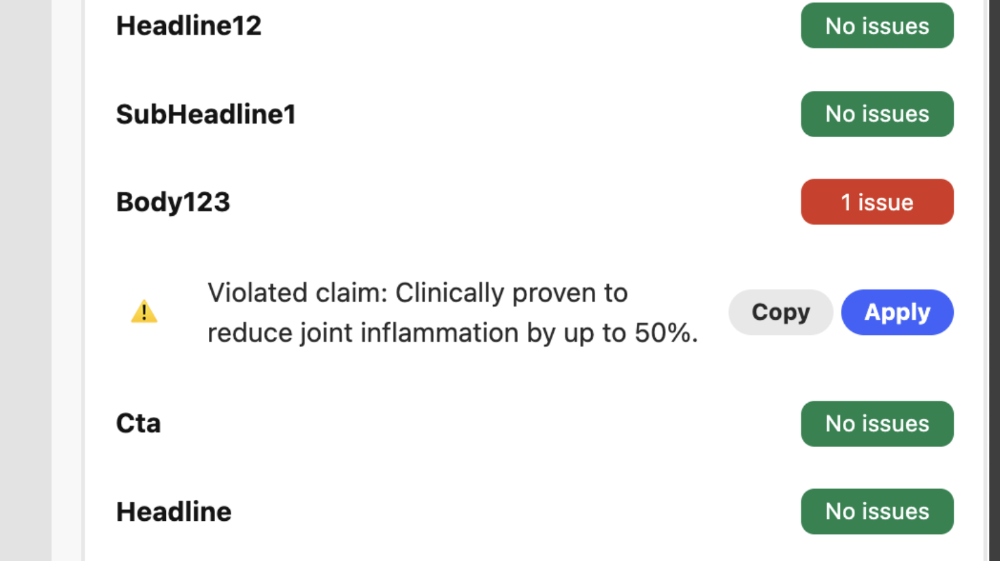
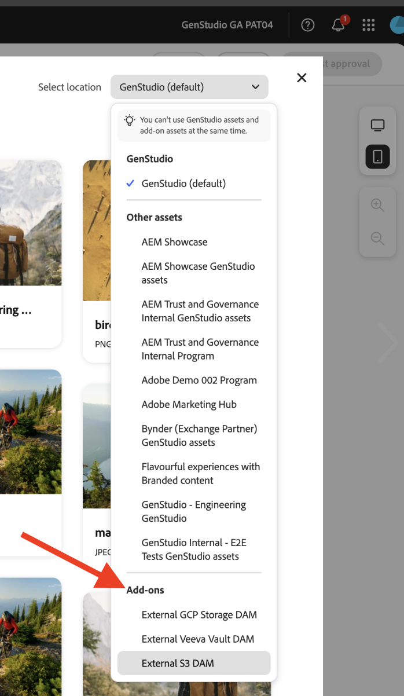

# Deploy your app

Running your app offers a preliminary snapshot of your Add-on's behavior before deploying it. This can help with debugging.

## Run the app

Run the app in `https://localhost:9080`:

```bash
aio app run
```

## Deploy the app

1. Navigate to your Deployment workspace:

   ```bash
   aio app use -w [deployment_workspace]
   ```

2. Deploy the app:

   ```bash
   aio app deploy
   ```

## Force re-deployment

You can force a build and deployment of your app without re-submitting it for approval.

>[!NOTE]
>
>Forcing a build and deployment overwrites your existing deployment. **Thoroughly test your app** in a test environment first.

   ```bash
   aio app build --force-build
   ```

   ```bash
   aio app deploy --force-deploy
   ```

## Build and deploy at the same time

   ```bash
   aio app deploy --force-build --force-deploy
   ```

## Find your new app

After deployment, you can view the new app in GenStudio for Performance Marketing.

### View with a URL

See the new app by adding a `query` parameter to the GenStudio for Performance Marketing URL:

```txt
https://experience.adobe.com/?ext=https://<my-deployed-add-on>.adobeio-static.net/index.html#/@<ims-org>/genstudio/create
```

### View in the UI

New extensions are found in different locations in the UI, depending on the type of extension you deployed. The currently available extension points are:

* Compliance extension, which includes:
  * [*prompt extension points*](#find-prompt-extensions), which allow customers to add additional context to LLM generation, and
  * [*validation extension points*](#find-validation-extensions), which allow customers to validate the generated content from the LLM. Validation is often paired with Prompt extension to make sure content generated with an extended prompt is complaint with customer requirements (for example, medical drug claims, or legal)
* [Digital Asset Management (DAM) extension](#find-dam-extensions)
* [Template extension](#find-template-extensions)
* [Translation extension](#find-translation-extensions)
* [Content Fragment extension](#find-content-fragment-extension)

### Find prompt extensions

Prompt extensions are found in the **Add-ons** dropdown, in the **parameters section** of a template.

{width="600" zoomable="yes"}

The add-on dialog will open, allowing you to select the additional context to add for the LLM generation.

{width="600" zoomable="yes"}

### Find validation extensions

Validation extensions can be found after a prompt generation, in the right sidenav displayed with the results.

{width="600" zoomable="yes"}

Run the extension you selected to validate the generated content.

{width="600" zoomable="yes"}

Where there are errors, you may use the extension to update the copy of experiences programmatically. Clicking the **[!UICONTROL Copy]** button will copy the suggested text to the clipboard. Clicking the **[!UICONTROL Apply]** button will apply the text to a specific text box in the generated experience.

{width="600" zoomable="yes"}

### Find DAM extensions

Digital Asset Management (DAM) extensions are found when selecting content in the **parameters section** of a template. See the bottom of the **Select location** dropdown to see any add-ons.

{width="600" zoomable="yes"}

### Find template extensions

Template extensions are found in the **External Template App** tab when selecting a template. This tab appears only when there are template apps to select.

{width="600" zoomable="yes"}

### Find translation extensions

Use Translation Extension Points to bring your own translation service through a proxy instead of using GenStudio default translation.
There's no UI location for these extensions.

If the extension is registered, the provided translation service is used. Otherwise the default GenStudio translation service is used.

### Find content fragment extension

The Content Fragment extension in [!DNL GenStudio for Performance Marketing] replaces text in generated email experiences on the [!DNL Create] Canvas with entries from a connected third-party (3P) repository. After you configure and deploy the extension, you swap copy from the Canvas without leaving your workflow.

>[!NOTE]
>
>Content Fragment extension swap is available for **email** experiences on the Canvas today. **Horizon** channel support is coming soon.

**To swap text using the Content Fragment extension**:

1. On the Canvas, click an editable text field in a generated email variant.
1. Click **[!UICONTROL Swap]**.
1. Select your third-party repository. Your organization controls which repositories appear and how the repository UI behaves.
1. Select the claim you want to use as replacement text for the field.

If you're satisfied with your Add-on, you're ready to distribute it without the `query` parameter.

Now, you can [distribute your app](distribute-app.md).
