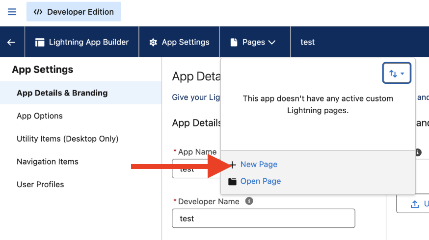

# Experience Selector MFE in Salesforce

This topic explains how customers and implementers can deploy and run the [!DNL GenStudio for Performance Marketing] Experience Selector micro frontend (MFE) in a Salesforce org. It covers administrator steps (no code), developer steps (deploy and configure), and security-related settings such as Content Security Policy (CSP).

For generic MFE integration options, configuration properties, and framework examples, see [GenStudio Experience Selector MFE](experience-selector.md).

## What this integration does

>[!VIDEO](https://video.tv.adobe.com/v/3491079?learn=on)

The Lightning Web Component (LWC) `sfgsmfe` loads Adobe's Experience Selector UMD bundle and renders it in a `<dialog>` so users can pick an experience from [!DNL GenStudio for Performance Marketing].

The integration can also:

* **Preview and decode:** Show the selected payload as JSON, decoded HTML, and a sanitized HTML preview inside the LWC.
* **Email templates (optional):** A **[!UICONTROL Create Email Template]** flow in Salesforce can call Apex (`EmailTemplateController.createEmailTemplate`) to insert an `EmailTemplate` record (HTML, subject, and folder).
* **Runtime loading:** The GenStudio script is loaded from Adobe's hosted URL on `experience.adobe.com`, not from a Salesforce Static Resource in the typical implementation.

## Prerequisites

* **Salesforce org:** A sandbox or production org where you can deploy metadata and use **[!UICONTROL Lightning App Builder]**.
* **Salesforce CLI:** The Salesforce CLI (`sf`) is installed and authenticated, for example:

  ```bash
  sf org login web --alias <your-org-alias>
  ```

* **Permissions:** Users who create email templates need access to the target email template folder and rights to create templates according to your org policies. Apex runs `with sharing`.
* **Adobe / GenStudio:** Your Adobe IMS organization ID and SUSI `clientId` must match your Adobe configuration (see [Configure integration values](#configure-integration-values-developer--implementation)).
* **Browser / CSP:** Salesforce must allow loading scripts from `https://experience.adobe.com` (see [Configure content security policy and Adobe URL](#configure-content-security-policy-and-adobe-url)).

## Deploy the package (developer)

The integration follows a Salesforce DX style layout. The default package directory is usually `force-app` in your Salesforce DX project.

1. From your project root, deploy source to the target org:

   ```bash
   sf project deploy start --source-dir force-app --target-org <your-org-alias>
   ```

2. Confirm that deployment completes without errors.

Typical metadata in your project includes:

* An LWC bundle named `sfgsmfe` (HTML, JavaScript, CSS, and meta XML) that hosts the selector UI and script loading.
* An Apex class (for example, `EmailTemplateController`) that creates email templates when you use that optional flow.
* `force-app/main/default/lwc/sfgsmfe` — LWC bundle (HTML, JS, CSS, meta).
* `force-app/main/default/classes/EmailTemplateController.cls` — Apex for template creation.

Your project may also define Static Resources. If the LWC loader uses the Adobe CDN URL for `standalone.js`, those resources are not required for that load path unless you change the implementation.

## Add the component to a Lightning page (admin)

The `sfgsmfe` component is exposed for:

* Lightning app pages
* Home pages
* Record pages
* Tabs (by placing the component on a Lightning page that is opened from a custom tab)

To add the component:

1. In **[!UICONTROL Setup]**, open **[!UICONTROL App Manager]**.
1. Create a **[!UICONTROL New Lightning App]** (or open an existing app you want to extend).
{width="80%" zoomable="yes"}
1. Open the app and select **[!UICONTROL Edit]**.
{width="80%" zoomable="yes"}
1. Create a **[!UICONTROL New Page]** (or edit an existing Lightning page).
{width="60%" zoomable="yes"}
1. In **[!UICONTROL Lightning App Builder]**, drag the **sfgsmfe** component onto the layout.
1. **[!UICONTROL Save]**, **[!UICONTROL Activate]**, and assign the page to the correct Lightning app, profiles, and app visibility so intended users can open it.

## Configure content security policy and Adobe URL

The LWC injects a `<script>` tag whose `src` points at Adobe's UMD bundle, for example:

`https://experience.adobe.com/solutions/GenStudio-experience-selector-mfe/static-assets/resources/@genstudio/experience-selector/umd/standalone.js`

You must configure Salesforce so this origin is permitted for script loading according to your org's CSP and Lightning security settings.

If the script fails to load:

1. Open the browser developer tools.
1. Check the **[!UICONTROL Console]** and **[!UICONTROL Network]** tabs for blocked requests or CSP violations.
1. Add or adjust **[!UICONTROL CSP Trusted Sites]** (and any related settings for your Salesforce release) for `https://experience.adobe.com`, following current Salesforce documentation for Lightning.

## Configure integration values (developer / implementation)

Several values are set in the LWC JavaScript for `sfgsmfe`. Customers typically replace these per environment.

| Value | Description |
| --- | --- |
| `folderId` | Salesforce folder ID (`00l...`) for email templates where new templates are created. Required for Apex; the folder must exist and be accessible to the running user. |
| `imsOrg` | Adobe IMS organization identifier passed into `GenStudioExperienceSelector.renderExperienceSelectorWithSUSI`. |
| `susiConfig.clientId` | Adobe SUSI client ID for the Experience Selector app registration. |
| GenStudio `script.src` | URL of the UMD `standalone.js` bundle; update if Adobe publishes a new path. |

Email template creation maps GenStudio fields to the template (for example, subject from `experienceFields`). Adjust mappings in the LWC if your content model differs.

For details on `renderExperienceSelectorWithSUSI` and related options, see [Configuration properties](experience-selector.md#configuration-properties) in the Experience Selector MFE topic.

## Apex: EmailTemplateController

`EmailTemplateController.createEmailTemplate` typically:

* Validates the template name, folder ID, and non-empty HTML.
* Creates an `EmailTemplate` with `TemplateType = 'custom'`, `HtmlValue`, `Subject`, `Body`, and folder assignment.
* Surfaces errors to the LWC through `AuraHandledException`.

Operational tips:

* Respect DeveloperName uniqueness and naming rules in the org.
* Confirm the folder ID and that the user can create `EmailTemplate` records in that folder.
* Use Salesforce debug logs when DML fails to capture the exact error.

## Validation checklist

Confirm the items in this list after deployment and configuration for a confident validation of the integration:

1. Deployment completes without errors.
1. Users can open the Lightning page that contains `sfgsmfe` and see the Experience Selector UI.
1. The component does not show a load error; the Network tab returns HTTP 200 for `standalone.js`.
1. **[!UICONTROL Select a GenStudio Experience]** opens the selector and selection callbacks run.
1. **[!UICONTROL Create Email Template]** succeeds when you use that flow, and the template appears under the configured folder in **[!UICONTROL Setup]**.

## See also

* [GenStudio Experience Selector MFE](experience-selector.md)
