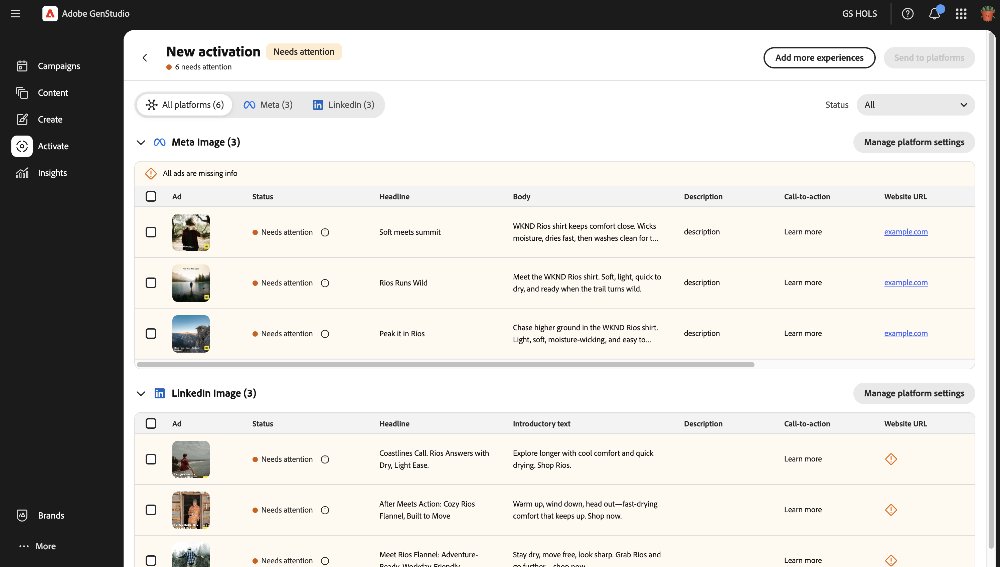
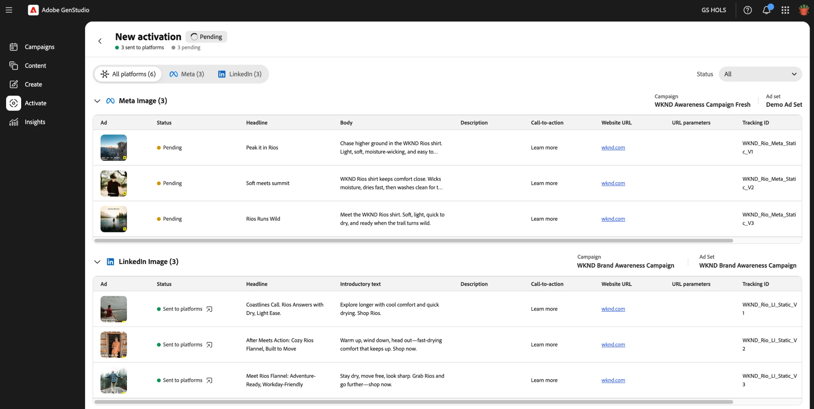

# Activation workflow

[!DNL Activate] activates published experiences to their paid ad platforms. A GenStudio for Performance Marketing experience is a marketing campaign component, such as an ad, that is prepared for a specific audience on a paid ad platform. Experiences for activation contain three main components:

* **Media assets**: Images or video included in your ad experience. Supported file types and aspect ratios vary by platform and format.

* **Text**: All forms of copy included in your ad, including headlines, body text, and call-to-action elements.

* **Metadata**: User-defined attributes that enhance performance analysis, filtering, and tracking. Metadata is typically not visible to the final ad audience.

You prepare and approve these components in [!DNL Content] before activation. [!DNL Activate] doesn't create or edit approved assets, headlines, or body copy. It only applies the setup each platform needs, then publishes the experience.

A single activation table can include experiences for multiple paid ad platforms and ad formats at once.

>[!VIDEO](https://video.tv.adobe.com/v/3503538?learn=on)

## Connect your platform accounts

A GenStudio system manager or editor must connect the ad accounts for each paid ad platform before you can activate an experience to that platform. To see the steps for this process, see [Connect paid media accounts](/help/user-guide/connectors/connect-channel.md).

## Start an activation

Start an activation from one of two entry points:

* **From [!DNL Content]**: Filter to Experiences, select one or more published experiences, then click **[!UICONTROL Activate]** on the top action bar.

  

* **From [!DNL Activate]**: On the [!DNL Activate] landing page, click **[!UICONTROL + New activation]**. This opens the same Experience gallery, where you select experiences for activation.

In either case, search by experience name or filter by multiple channels to find the experiences you want.

If your selection includes display-format experiences, specify which display platform to use: Google Campaign Manager 360, Innovid, Amazon Ads, or The Trade Desk. Then click **[!UICONTROL Start activation]**. For other formats, such as Meta, LinkedIn, TikTok, YouTube, and ChatGPT, [!DNL Activate] infers the platform from the experience's channel and skips this step.

[!DNL Activate] then generates an activation table listing all your selected experiences.

The table is organized into sub-tables by ad format and platform, for example Meta single image or LinkedIn single image. Each row represents one ad. For most platforms, such as LinkedIn, TikTok, and display platforms, an experience with multiple aspect ratios generates one row per aspect ratio; delete any rows you don't need. Meta is the exception. A Meta ad can include multiple aspect ratios within a single ad, so a multi-aspect-ratio Meta experience still generates only one row.

## Manage your activation table

Your activation table saves as a draft automatically when it opens. You can leave and resume the draft at any point before publishing.

To add more experiences to an activation table you already opened, click **[!UICONTROL Add more experiences]** in the top right of the table. This reopens the Experience gallery so you can select additional experiences, which [!DNL Activate] adds to the existing table.

**[!UICONTROL Add more experiences]** also lets you activate to more than one display platform in the same table. Display-format experiences ask you to choose a single display platform first, but you can click **[!UICONTROL Add more experiences]**, select more display-format experiences, and choose a different display platform than the one already in your table. For example, you can add The Trade Desk ads to a table that already contains Innovid ads.

Once your table has the right experiences, configure each ad's fields next.

## Configure ad and platform setup details

Edit fields inline per row, or select multiple rows within the same format table and click **[!UICONTROL Edit details]** on the toolbar that appears to bulk-edit those fields at once.

Approved assets, headlines, and body copy are locked and can't be edited in the activation table, since they already went through review and approval in [!DNL Content]. The remaining fields can be edited, and vary by platform. [!DNL Activate] only shows the columns relevant to the platforms and formats you selected. Use the table below as a reference for what's editable per platform.

**Editable fields by platform**

| Platform | Formats supported | Locked copy | Editable text fields | Editable platform setup fields |
|---|---|---|---|---|
| Meta | Image, Video, Carousel | Headline, Body | Description, Call-to-action, Destination URL, URL Parameters, Tracking ID | Ad account, Facebook page, Instagram profile, Meta campaign, Meta ad set |
| LinkedIn | Single Image, Single Video | Headline, Introductory Text | Description, Call-to-action, Destination URL, URL Parameters, Tracking ID | Ad account, Campaign, Ad Set |
| Google Campaign Manager 360 | Static Display, Video Display, HTML5 Zip Display | n/a | Tracking ID | Advertiser |
| Amazon Ads | Static Display | n/a | Tracking ID | Account |
| Innovid | Static Display, HTML5 Zip Display | n/a | Tracking ID | Account, Creative Library, Concept Name |
| TikTok | In-Feed Video Ads | Primary Text | Call-to-action, Destination URL, Tracking ID | Ad account, Campaign, Ad group |
| YouTube | Shorts in Google Ads Demand Gen campaigns | Description | Call-to-action, Business name, Destination URL, URL Parameters, Tracking ID | Account, Campaign, Ad Group, Logo |
| ChatGPT | Chat Cards | Title, Body | Target URL, Tracking ID | OpenAI ad account, OpenAI Campaign, OpenAI Ad group |
| The Trade Desk | Static Display | n/a | Tracking ID | Account, Campaign |

To configure platform setup fields for a group of ad formats, click **[!UICONTROL Manage platform settings]** and edit the fields in the resulting dialog.

The **[!UICONTROL Tracking ID]** fields are initially blank. A Tracking ID is the same thing as the ad platform's ad name or creative name, and is passed to the ad platform as the identifying name for the ad. Use this field to identify that ad for reporting and troubleshooting. Enter the values you want to use in the **[!UICONTROL Tracking ID]** fields.

To move between **[!UICONTROL Tracking ID]** fields more quickly, use these keyboard shortcuts:

* Press **Enter** to open the edit field for the selected **[!UICONTROL Tracking ID]**.
* Press the **Up** or **Down** arrow key to move to the previous or next **[!UICONTROL Tracking ID]** field in that column.
* Press **Enter** again to save your edit.

## Review and publish your experiences to their ad platforms

Confirm that every row shows [!UICONTROL Ready to Activate]. [!DNL Activate] flags missing or invalid fields, incompatible calls to action, and duplicate tracking IDs as [!UICONTROL Needs Attention]. When every row is ready, click **[!UICONTROL Send to platforms]** and confirm in the publish dialog.

[!DNL Activate] reports each ad's status in near real time: Pending, then Sent to platforms or Failed. If an ad fails, hover over its status to see the platform's error. You can retry every failed ad in the table at once by clicking **[!UICONTROL Try again]**, rather than retrying each one individually. Rows already sent to platforms are locked from resubmission and include a deep link to the ad in the destination platform's native ad manager. Your final pre-publication review, and launching ads, happens in the destination platform's own ad manager: [!DNL Activate] always delivers ads in an inactive state.

Your activation tables appear on the [!DNL Activate] landing page.

## Supported platforms

Each paid ad platform has specific setup fields and prerequisites. Select the paid ad platform for activation guidelines:

* [Meta](activate-meta-ad.md)
* [LinkedIn](activate-linkedin-ad.md)
* [Google Campaign Manager 360](activate-cm360-ad.md)
* [Amazon Ads](activate-amazon-ad.md)
* [Innovid](activate-innovid-ad.md)
* [TikTok](activate-tiktok-ad.md)
* [YouTube](activate-youtube-ad.md)
* [ChatGPT](activate-chatgpt-ad.md)
* [The Trade Desk](activate-trade-desk-ad.md)
