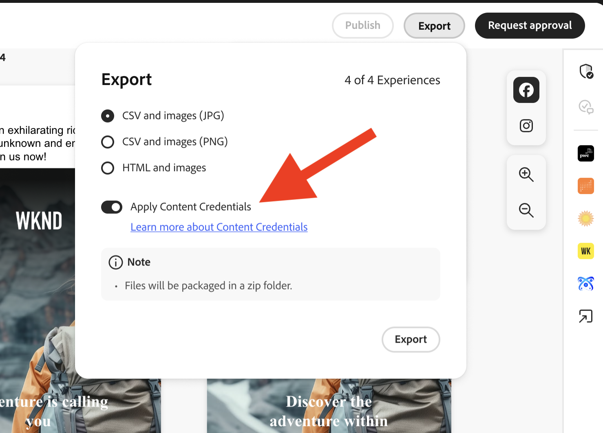
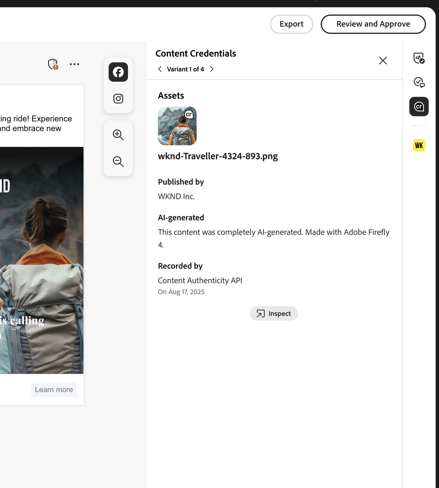

# Content Credentials for organizations

Learn how tamper-proof credentials for content that prove brand authenticity and drive compliance are embedded directly in your marketing workflow. 

>[!WARNING]
>
>This feature is currently in beta and is only available to organizations that have been granted access. If interested, please reach out to your Adobe account team representative to be enrolled.

## Get started with Content Credentials 

After Content Credentials have been activated in the Admin Console, GenStudio for Performance Marketing users can turn on Content Credentials for all assets globally in the app. If the global option to apply credentials is turned off, users have the choice to apply Content Credentials for each individual asset.  

Once content is published, Content Credentials will be visible on external platforms, like LinkedIn. 

Administrators are responsible for uploading a valid X.509 certificate within the Admin Console. This step ensures that the enterprise's digital signature is properly configured and ready for use in supported Adobe DX applications. 

>[!NOTE]
>
>Control over this setting might transition to the Admin Console in the future, streamlining the management of Content Credentials across applications and enhancing administrative oversight.

## What are Content Credentials?  

Content Credentials are a durable, industry-standard type of metadata with details about how content was made and identity information about the creators. Content Credentials can be viewed when the content is published online to supporting platforms, or by using tools like [Adobe's Inspect tool](https://contentauthenticity.adobe.com/inspect) or the [Adobe Content Authenticity Chrome browser extension](https://helpx.adobe.com/creative-cloud/help/cai/adobe-content-authenticity-chrome-browser-extension.html).   

Applying Content Credentials can help increase transparency about how content was made and can help your users connect themselves to their content.  

[Learn more about Content Credentials](https://helpx.adobe.com/creative-cloud/help/content-credentials.html) at Adobe.

## Brand signature and asset tracking 

Brand-signed content plays a significant role in promoting brand integrity and user trust. Organizations can sign their content with a unique brand signature in Adobe applications when their certificate is properly configured in the Admin Console. This assurance of authenticity is maintained using invisible watermarking and fingerprinting technologies, which help preserve the durability of the signature throughout the content's lifecycle. 

In addition to brand signing, enterprises can attach asset IDs directly to their content. This facilitates efficient tracking of assets, particularly when they are shared or posted on social media platforms. By incorporating asset IDs, organizations can trace the origin and distribution path of their content, enhancing oversight and accountability. 

## Content Credentials in the marketing workflow

Applying Content Credentials can be done throughout the marketing workflow directly in GenStudio for Performance Marketing, from import and content discovery to activation and export. You'll also find credentials displayed on content for review throughout the app. 

### Import and discovery 

In the Content gallery, credentials are displayed on imported assets. 

The Content Credential badge in the upper right corner of the thumbnail indicates "Brand signed" content. 

{width="350"}

Selecting signed content displays the detailed metadata: published brand, recorder, tool used, timestamp. 

Content can be filtered by credential status. 

### Creation and selection 

Content Credential badges are shown in the Canvas asset selector. 

Credential metadata is preserved as assets are selected for experiences to maintain the provenance chain throughout editing. 

### Editing and transformation 

During exports from a draft, modified assets are automatically re-signed and the new credential links to the original.  

{width="300"}

### Review and approval 

In the Review and Approve preview, credential status is displayed for assets on the right rail. 

{width="300"}

Per-variant credential details are shown as reviewers inspect the assets. Approved experiences are re-signed when users click **[!UICONTROL Save to Content]**. 

### Activation and export 

During Activation, credential status shows in the Experience selector. 

{width="350"}

Exported files will have C2PA-compliant credentials embedded. 

Credential integrity is maintained across all supported formats (JPEG, PNG, MP4). 

