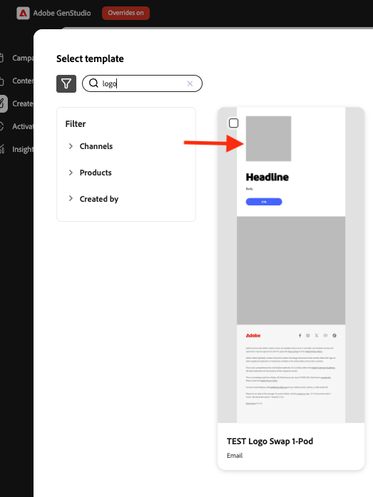
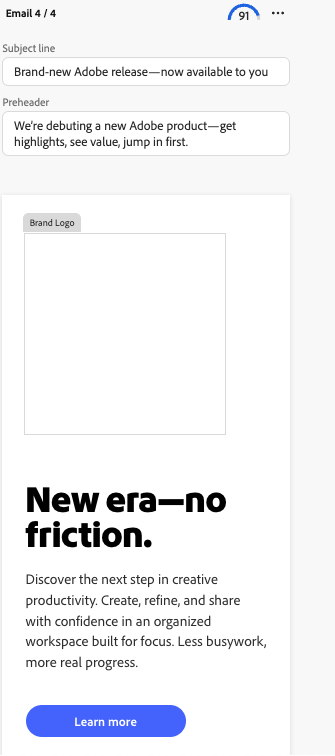
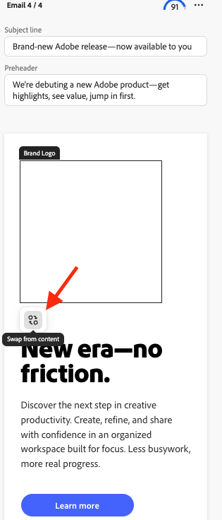
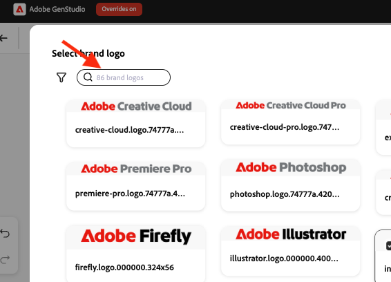
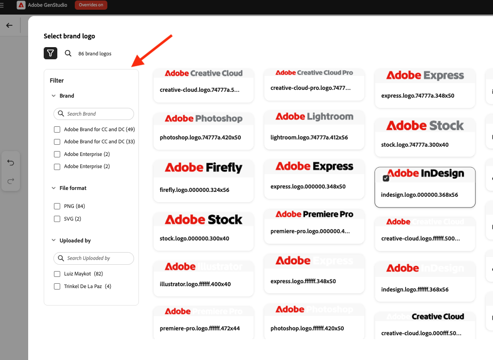

# Use Logo Swap in [!DNL Create]

Use Logo Swap to replace brand logos in templates during content creation in [!DNL GenStudio for Performance Marketing].

## Prerequisites

- Set up templates using the [Logo Swap setup guide](logo-swap-setup.md). The Logo Swap icon appears only for templates that include the required logo placeholders.
- To have interchangeable logos during the **[!DNL Create]** workflow, there must be logos stored within **[!DNL Brands]**.

## Swap a logo during content creation

1. In **[!DNL Create]**, select a channel on the landing page.
1. Choose a template that includes a swappable logo. The template preview shows a gray placeholder box where the logo appears.
{width="300"}
1. Create content as usual. Four variants appear.
1. Hover over the logo area to reveal the placeholder.
{width="200"}
1. Click the Brand Logo area, then click **[!UICONTROL Swap from Content]**.
{width="200"}
1. In the Brand Logo panel, select a logo, then click **[!UICONTROL Use]** to apply it to the current variant or **[!UICONTROL Apply to all variants]** to apply it to all four variants.
1. You can also use search logos by brand name or filter to find a logo.
{width="300"}
1. Or use a filter search to find a logo.
{width="300"}
1. With the logo succesfully swapped, continue the content creation workflow (close the draft, export, or request approval).

Logos can be swapped again at any time.

>[!NOTE]
>If the Logo Swap icon does not appear, confirm that the template is configured for Logo Swap and that logos are available in [!DNL Brands].
