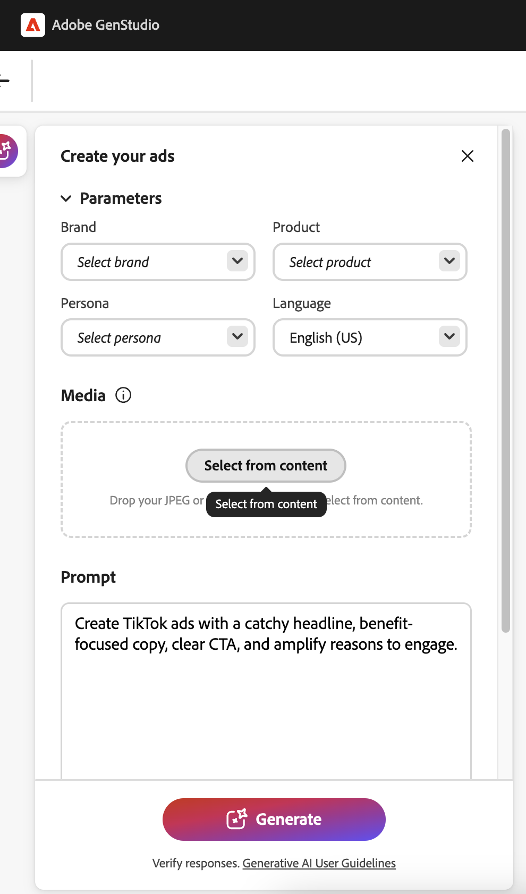
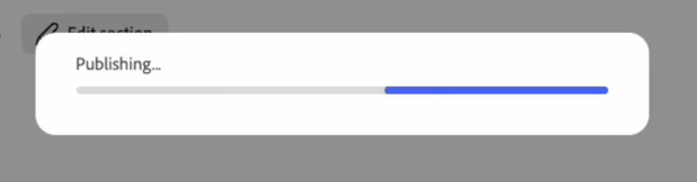

# TikTok experiences

Using [!DNL GenStudio for Performance Marketing], you can create TikTok ads as paid media experiences in the [[!DNL Create]](/help/user-guide/create/overview.md) workflow. Generate creative variants, run brand and channel checks, publish to [!DNL Content], and activate through [[!DNL Activate]](/help/user-guide/activation/overview.md), to deliver content to TikTok Ads Manager for final review and launch.

TikTok in [!DNL GenStudio for Performance Marketing] fits into a broader omnichannel workflow: you can analyze TikTok campaign and ad performance in [[!DNL Insights]](/help/user-guide/insights/overview.md) alongside other social and display channels (such as Meta and LinkedIn), instead of switching to separate reporting tools.

[!DNL Insights] surfaces metrics, including:

* Impressions
* Clicks
* Click-through rate (CTR)
* Cost per click (CPC)
* Cost per acquisition (CPA)
* Cost per mille (CPM)
* Spend

See your results, compare creative effectiveness, and refine targeting and budgets all in one place. Daily data updates help you optimize faster without leaving [!DNL GenStudio for Performance Marketing].

## Prerequisites

Before you create or activate TikTok ads, complete the following:

### Access and role

Be sure you have an **Editor** role or higher in GenStudio for Performance Marketing. See [User roles and permissions](/help/user-guide/user-roles.md).

### Connect your TikTok Ads account

1. Go to **[!UICONTROL Settings]** > **[!UICONTROL TikTok]** > **[!UICONTROL Manage]** > **[!UICONTROL Add Account]**.
1. In the pop-up, sign in to TikTok Ads Manager.
1. Ensure you have **Operator** or **Admin** access to the ad account.
1. Add TikTok as a channel and complete OAuth sign-in to TikTok Ads Manager.

### Activate configuration

A System Manager has connected your TikTok Ads account in [!DNL Activate]:

* At least one TikTok ad account is enabled for use.

### Create configuration

* Your [brand, products, and personas](/help/user-guide/guidelines/overview.md) are configured so the app can generate on-brand copy and layouts.
* At least one TikTok template is uploaded. Adobe recommends a TikTok vertical video template, optimized for in-feed placement, with a **9:16** aspect ratio and safe zones for top and bottom UI.
* Videos are uploaded to [!DNL Content].

## Generate a TikTok in-feed ad

### Start a TikTok experience

{width="90%"}
**To start a TikTok experience**:

1. Go to **[!UICONTROL Create]** and choose **[!UICONTROL TikTok]**.
1. Select a TikTok template and click **[!UICONTROL Use]**.
1. In the canvas, select **[!UICONTROL Brand]**, **[!UICONTROL Product]**, **[!UICONTROL Persona]**, and **[!UICONTROL Language]**.
1. Select a video from [!DNL Content].
1. Enter a prompt for your TikTok headline copy.
1. Click **[!UICONTROL Generate]**.
{width="40%"}

GenStudio for Performance Marketing generates four creative variants.

You can:

* Use **[!UICONTROL Regenerate]** or **[!UICONTROL Refine]** to adjust tone, length, or emphasis.
* Edit text directly in the canvas.
* Use **[!UICONTROL Swap]** to select an alternative video from [!DNL Content].
* Use **[!UICONTROL Crop]** or **[!UICONTROL Reframe]** to adjust the video layout within the **9:16** frame.

### Run brand and channel checks

Before you save or send the experience for review,run content checks:

1. Click **[!UICONTROL Content check]** (brand and channel checks).
1. Review validation results for:
   * **Brand guidelines**—tone, restricted terms, logo usage.
   * **TikTok channel rules**—aspect ratio, file type, copy length.
1. Resolve any flagged issues (for example, copy length or dense on-screen text).

See [Brand validation](/help/user-guide/guidelines/brand-validation.md) for more about content checks.

## Save a TikTok ad in GenStudio for Performance Marketing

Move your TikTok experience into the [!DNL Content] library so it can be reviewed, reused, and activated.
There are two states:

* **Draft experience** —  A work in progress and not approved.
* **Published experience** — Content approved and available in [!DNL Content] for activation.

### Send for review

**To send for review**:

1. In the **[!DNL Experience]** header, click **[!UICONTROL Request review]**.
1. Select approvers (for example, brand, legal, or performance).
   * (Optional) Add a note in **[!UICONTROL Settings]**.
1. Click **[!UICONTROL Send for review]**.

Approvers can view the video preview, description, and call to action (CTA) and brand and channel check results. They can approve the experience or request changes.

### Publish to [!DNL Content]

After all required approvals:

1. Click **[!UICONTROL Publish to Content]**.
1. Confirm metadata:
   * Campaign or activation name
   * Region, language, persona, funnel stage
   * Channel: TikTok
1. Click **[!UICONTROL Publish]**.

The TikTok ad now appears in [!DNL Content]. It is discoverable using filters such as [!DNL Channel] or [!DNL Campaign], and it is ready for selection in [!DNL Activate].

## Activate a TikTok ad

TikTok activation uses the same [!DNL Activate] module as Meta and Campaign Manager 360 (CM360). You can start from the [!DNL Content] workflow or from the [!DNL Activate] workflow.

**To start a TikTok activation**:

1. Open the TikTok channel tile.
1. Click **[!UICONTROL Create activation]**.
1. Select one or more published TikTok experiences from [!DNL Content].

Each experience typically maps to one TikTok ad, with one or more video variants.

### Configure experience setup

For each selected experience, confirm:

* Primary text
* Call to action
* Destination URL

### Configure platform setup

Provide TikTok Ads Manager details like:

* TikTok Ads account
* Campaign
* Ad group
* Ad name (one per TikTok ad)

### Review and publish

1. Review all creative and platform details.
1. Click **[!UICONTROL Publish]**.

GenStudio for Performance Marketing pushes ads to TikTok Ads Manager in a paused or draft state.

### What happens next

A _Publishing in progress_ modal appears and closes automatically. You're redirected to the TikTok Activation table.

{width="30%"}

The activation table shows the latest activations, with a **Pending** status while processing completes.You can navigate away while publishing completes.

{width="90%"}

Once completed, a confirmation pop-up shows a success or failure message. If you click that pop-up, or click the TikTok activation in the activation table, you open the **Details** page. The **Details** page contains the full activation information and a deep link to the published ad in TikTok Ads Manager.

If activation fails, a **Failed** status appears along with an error message from TikTok.

In TikTok Ads Manager, media teams can:

* Perform final checks.
* Turn ads or ad groups live.

As with other channels, GenStudio for Performance Marketing delivers creatives in an inactive state so channel owners control final launch timing and budget.
