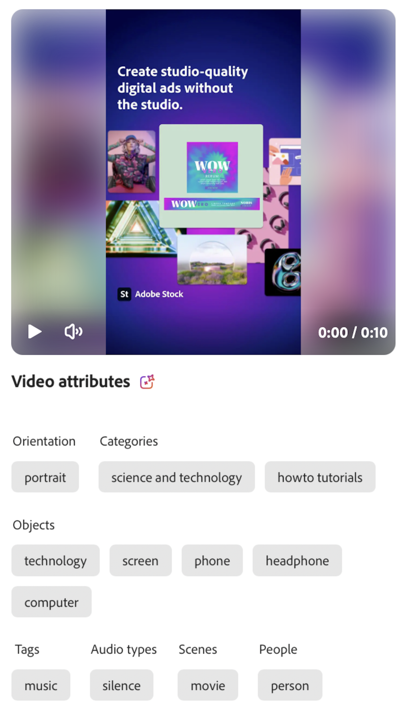

# Attribute categories

An attribute category is a classification group that organizes related attributes that share a common characteristic. These categories help streamline the discovery, identification, and understanding of specific attributes by providing greater context and facilitating their application and use.

## Image features

Image features represent distinct and informative elements or patterns within an image that are used for analysis with Insights. GenStudio for Performance Marketing uses Adobe's AI and machine learning capabilities to study the image and apply tags based on the inherent features. The following table lists the image feature categories recognized by the GenStudio for Performance Marketing AI.

<!-- For the writer, turn off word wrap to work with these tables. In VSCode, toggle View - Word Wrap. -->

| Category                | Description                                                                                           | Example                                                                                                                                                                        |
| ----------------------- | ----------------------------------------------------------------------------------------------------- | ------------------------------------------------------------------------------------------------------------------------------------------------------------------------------ |
| Camera angle            | The location and angle of the camera relative to the subject.                                         |                                                                                                                                                                                |
| Subject distance        | The distance between the camera and the subject of an image.                                          | `close up`, `mid shot`, `long shot`                                                                                                                                            |
| Camera setting          | The configuration of the camera's controls to produce the image.                                      |                                                                                                                                                                                |
| Color and tone          | Evaluates colors used in image elements. Image may receive a maximum of three dominant colors for **[!UICONTROL Foreground Colors]** (elements in the front layer of the image) and **[!UICONTROL Background Colors]** (elements in the back layer of an image). **[!UICONTROL Color Temperature]** describes the general warmth or coolness of colors in the image. | Colors: Identifies one to three colors from a set of 40 pre-determined colors. Tones: `warm`, `cool`, `neutral` {width="200" zoomable="yes"} |
| Image style             | The visual treatment of an image.                                                                     |                                                                                                                                                                                |
| Lighting condition      | The type of light in an image.                                                                        |                                                                                                                                                                                |
| Objects                 | Identifies one or more items, entities, and elements that make up the image.                          | {width="200" zoomable="yes"}                                                                        |
| Orientation             | The relative position of the image based on the aspect ratio.                                             | `landscape`, `portrait`, `square`                                                                                                                                      |
| People                  | When one or more people are present, describes the person or people in the image.                     | {width="200" zoomable="yes"}                                                                                    |
| Photography genres      | Detects the subject and technique used to capture an image, such as `abstract` or `landscape` though not to be confused with a landscape orientation. |                                                                                                                                |
| Scenes                  | Detects the setting or environment depicted in an image.                                              |                                                                                                                                                                                |
| Tags                    | Detects objects, elements, and other image characteristics that do not fall under a specific classification. |                                                                                                                                                                         |

<!-- Not yet approved by legal
| Attention distribution  | The level of viewer attention spread across an image.                                                 | `high`, `medium`, `low`                                                                                                                                                                                                    |
| Content density         | The amount of information or detail in an image.                                                      | `high`, `medium`, `low`                                                                                                                                                                                                    |
-->

## Video features

Image features represent distinct and informative elements, sounds, or patterns within a video for analysis with Insights. GenStudio for Performance Marketing uses Adobe's AI and machine learning capabilities to study the video and apply tags based on the inherent features. The following table lists the video feature categories recognized by the GenStudio for Performance Marketing AI.

| Category            | Description                                                                                               | Example                                                  |
| ------------------- | --------------------------------------------------------------------------------------------------------- | -------------------------------------------------------- |
| Audio Genre         | When music is present, the video may receive one classification of music style, such as `electronic` or `classical`.                       |          |
| Audio Genre Category| When music is present, the video may receive one broad classification of music genre, such as `acoustic` or `traditional`.                  |          |
| Audio Mood          | Describes the general atmosphere or tone of the audio, such as `relaxing` or `energetic`.                     |          |
| Audio Types         | When audio is present, the video may receive a tag for one or more audio types, such as `music` or `speech`.                                         |          |
| Objects             | Identifies one or more items, entities, and elements that appear throughout the video.             | {width="200" zoomable="yes"}       |
| Orientation         | The relative position of the video based on the aspect ratio of the frame.            | `landscape`, `portrait`, `square`        |
| People              | When a person is present, describes the kinds of people in the video.            |        |
| Scenes              | The setting or environment depicted in the video.            |        |
| Styles              | Detects visual treatments applied to elements in the video, such as `matte` or `neon`.      |        |
| Tags                | Detects objects, elements, and other video characteristics that do not fall under a specific classification.  |        |

## Text features

Text features include counts for certain text elements, such as words, sentences, emojis, and classifications for semantics, emotion, and tone that are used for analysis with Insights. Text may also receive a readability score. Coming soon.

<!-- Not yet approved by legal

GenStudio for Performance Marketing uses Adobe's AI and machine learning capabilities to study text and apply tags based on the inherent features.

The following table lists the image feature categories recognized by the GenStudio for Performance Marketing AI.

| Category             | Description | Example |
|----------------------|-------------|--------|
| Emojis Count         |             |        |
| HashTags Count       |             |        |
| Keywords             |             |        |
| Marketing Emotions   |             |        |
| Narratives           | Text that represents an overarching situation, theme, or a story. Narratives can communicate values, purpose, or identity that resonates with consumers on many levels.   |        |
| Persuasion Strategies|             |        |
| Readability          |             |        |
| Tone of voice        | | |
-->
