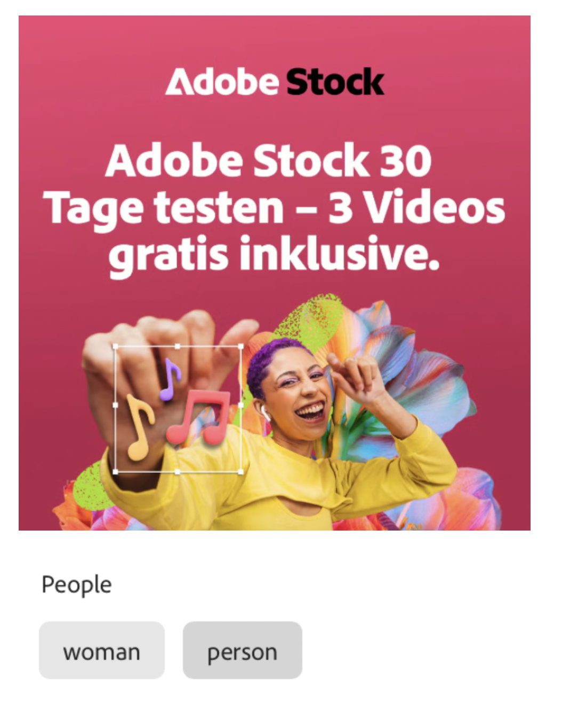

# Attribute categories

An attribute category is a classification group that organizes related attributes that share a common characteristic. These categories help streamline the discovery, identification, and understanding of specific attributes by providing greater context and facilitating their application and use.

## Image features

The following table lists the image feature categories recognized by the GenStudio for Performance Marketing generative AI.

<table>
  <thead>
    <tr>
      <th>Category</th>
      <th>Description</th>
      <th>Values</th>
    </tr>
  </thead>
  <tbody>
    <tr>
      <td>Camera Position</td>
      <td>The location and angle of the camera relative to the subject.</td>
      <td>- `low angle`, `high angle`, `dutch angle` - `overhead view`, `eye level`,`bird's eye view`</td>
    </tr>
    <tr>
      <td>Camera Proximity</td>
      <td>The distance between the camera and the subject of an image.</td>
      <td>`close up`, `mid shot`, `long shot`</td>
    </tr>
    <tr>
      <td>Camera Setting</td>
      <td>The configuration of the camera's controls to produce the image.</td>
      <td>- `fast shutter speed`, `long exposure`, `double exposure` - `normal mode`, `flash`, `macro`, `wide-angle` - `black and white`, `surreal` - `bokeh blur`, `motion blur`, `tilt-shift blur`</td>
    </tr>
    <tr>
      <td>Colors and tone</td>
      <td>The colors identified in important image elements in the background or foreground of the image. The overall warmth or coolness of the image colors.</td>
      <td>Colors: Identifies one to three colors from a set of 40 pre-determined colors. Tones: `warm`, `cool`, `neutral`</td>
    </tr>
    <tr>
      <td>Image Type</td>
      <td>The visual treatment of an image.</td>
      <td>`photograph`, `sketch`, `painting`, `digital cartoon`, `infographics`, `graphic design`, `collage`, `screenshot`</td>
    </tr>
    <tr>
      <td>Lighting Condition</td>
      <td>The type of light in an image.</td>
      <td>`golden hour`, `blue hour`, `midday`, `overcast`, `night`, `high-key`, `low-key`, `daylight`, `incandescent`, `fluorescent`, `colorful`, `studio`</td>
    </tr>
    <tr>
      <td>Objects</td>
      <td>The items, entities, and elements that are visible.</td>
      <td>Examples: `lighthouse`, `orchid`, `tunnel`</td>
    </tr>
    <tr>
      <td>Orientation</td>
      <td>Image alignment, based on its width-to-height ratio.</td>
      <td>Examples: `landscape`, `portrait`, `square`</td>
    </tr>
    <tr>
      <td>People Categories</td>
      <td>The kinds of people in an image.</td>
      <td>Examples: `person`, `social group`, `people`, `kid` </td>
    </tr>
    <tr>
      <td>Photography Styles</td>
      <td>The subject and technique used to capture an image.</td>
      <td>`aerial`, `architectural`, `astrophotography`, `black and white`, `business`, `cityscape`, `commercial`, `composite`, `creative`, `editorial`, `event`, `family`, `fashion`, `fine art`, `food`, `holiday`, `indoor`, `landscape`, `lifestyle`, `macro`, `minimalist`, `night`, `outdoor`, `pet`, `portrait`, `product`, `real estate`, `seascape`, `sports`, `still-life`, `street`, `travel`, `underwater`, `wildlife`</td>
    </tr>
    <tr>
      <td>Scenes</td>
      <td>The setting or environment depicted in an image.</td>
      <td>Examples: `city`, `island`, `living room`</td>
    </tr>
    <tr>
      <td>Tags</td>
      <td>Objects, elements, and other image characteristics.</td>
      <td>Examples: `gaming`, `law`, `yoga`</td>
    </tr>
    <tr>
      <td>Visual Attention Spread</td>
      <td>The level of viewer attention spread across an image.</td>
      <td>`high`, `medium`, `low`</td>
    </tr>
    <tr>
      <td>Visual Content Density</td>
      <td>The amount of information or detail in an image.</td>
      <td>`high`, `medium`, `low`</td>
    </tr>
  </tbody>
</table>

## Video features

The following table lists the video feature categories recognized by the GenStudio for Performance Marketing generative AI.

<table>
  <thead>
    <tr>
      <th>Category</th>
      <th>Description</th>
      <th>Values</th>
    </tr>
  </thead>
  <tbody>
    <tr>
      <td>Audio Genre</td>
      <td></td>
      <td></td>
    </tr>
    <tr>
      <td>Audio Genre Category</td>
      <td></td>
      <td></td>
    </tr>
    <tr>
      <td>Audio Mood</td>
      <td></td>
      <td></td>
    </tr>
    <tr>
      <td>Audio Types</td>
      <td></td>
      <td></td>
    </tr>
    <tr>
      <td>Objects</td>
      <td></td>
      <td></td>
    </tr>
    <tr>
      <td>Orientation</td>
      <td></td>
      <td></td>
    </tr>
    <tr>
      <td>People Categories</td>
      <td></td>
      <td></td>
    </tr>
    <tr>
      <td>Scenes</td>
      <td></td>
      <td></td>
    </tr>
    <tr>
      <td>Styles</td>
      <td></td>
      <td></td>
    </tr>
    <tr>
      <td>Tags</td>
      <td></td>
      <td></td>
    </tr>
    <tr>
      <td>Video Category</td>
      <td></td>
      <td></td>
    </tr>
    <tr>
      <td>Video Type</td>
      <td></td>
      <td></td>
    </tr>
  </tbody>
</table>

## Text features

The following table lists the text feature categories recognized by the GenStudio for Performance Marketing generative AI.

<table>
  <thead>
    <tr>
      <th>Category</th>
      <th>Description</th>
      <th>Values</th>
    </tr>
  </thead>
  <tbody>
    <tr>
      <td>Emojis Count</td>
      <td></td>
      <td></td>
    </tr>
    <tr>
      <td>HashTags Count</td>
      <td></td>
      <td></td>
    </tr>
    <tr>
      <td>Keywords</td>
      <td></td>
      <td></td>
    </tr>
    <tr>
      <td>Marketing Emotions</td>
      <td></td>
      <td></td>
    </tr>
    <tr>
      <td>Narratives</td>
      <td></td>
      <td></td>
    </tr>
    <tr>
      <td>Persuasion Strategies</td>
      <td></td>
      <td></td>
    </tr>
    <tr>
      <td>Readability</td>
      <td></td>
      <td></td>
    </tr>
    <tr>
      <td>Sentences Count</td>
      <td></td>
      <td></td>
    </tr>
    <tr>
      <td>Stop Words Ratio</td>
      <td></td>
      <td></td>
    </tr>
    <tr>
      <td>Text Quotes Count</td>
      <td></td>
      <td></td>
    </tr>
    <tr>
      <td>Tones</td>
      <td></td>
      <td></td>
    </tr>
    <tr>
      <td>Words Count</td>
      <td></td>
      <td></td>
    </tr>
    <tr>
      <td>Words Count Per Sentence</td>
      <td></td>
      <td></td>
    </tr>
  </tbody>
</table>
