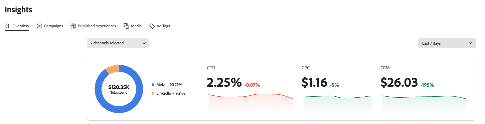
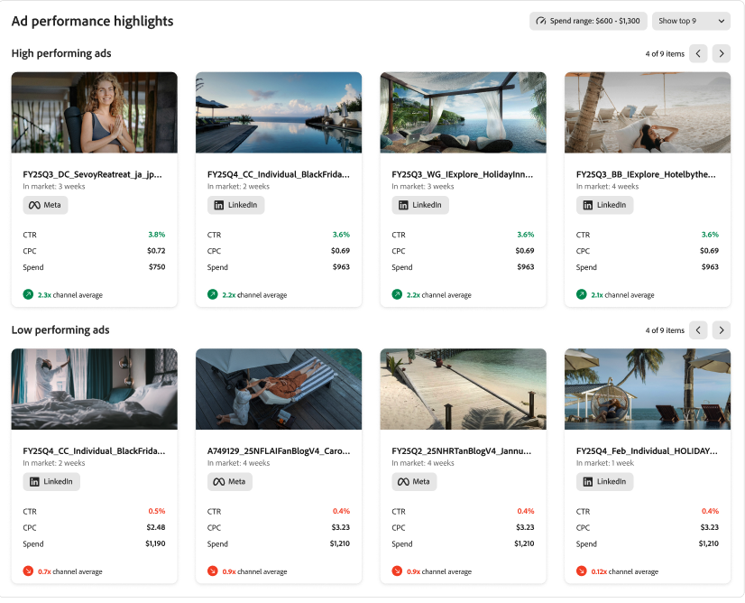
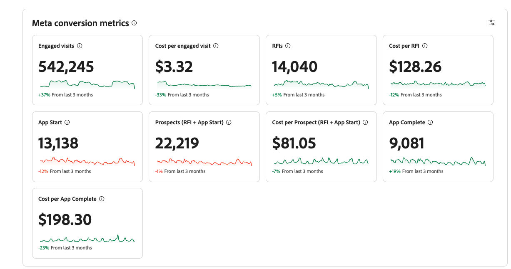

# Adobe GenStudio for Performance Marketing Insights

Adobe GenStudio for Performance Marketing [!DNL Insights] provides advanced analytics and insights into content performance that can help you make data-driven decisions.

From the [!DNL Insights] dashboard, you can:

- **Identify the most effective content**: Pinpoint which content performs best for different audiences and tailor future content or campaigns for trending preferences.
- **Optimize low-performing content**: Find content that is not performing well and use the integrated generative AI to create variations immediately, potentially improving its effectiveness without starting from scratch.
- **Revitalize high-performing content**: Take successful content and tweak it to refresh the ad for the audience or adapt hero content for use in new campaigns, potentially extending its lifecycle and performance.

The [!DNL Insights] module includes **[!UICONTROL Insights 2.0]**, a cross-channel performance experience for paid social. It works alongside the detailed table and gallery views in the [Dashboard](#dashboard) section of this article.

## Insights 2.0 {#insights-20}

**[!UICONTROL Insights 2.0]** delivers a performance intelligence layer that gives marketers a clear view of how paid social marketing is performing across connected accounts.

**In [!UICONTROL Insights 2.0], you can:**

- **Review cross-channel or single-channel overviews (Meta and LinkedIn)**: See a consolidated snapshot across both paid social channels, or drill down into one channel.
- **Use the cross-channel performance report**: View each channel's share of results with a percentage contribution visualization, including total spend (percentage and amount) and performance share metrics such as CTR, CPC, and CPM.

- **Use the ad performance report**: Identify high and low performing ads with rankings and metrics that support optimization decisions.

- **Analyze Meta conversion metrics**: Focus on conversions with visibility into CPA across funnel stages (for example, engaged visits, request for information, app start, prospect, and app complete) and review conversion trends over time, with conversion data available in GenStudio for Performance Marketing.

- **Explore insights from ad tags**: Ad tracking IDs are parsed into structured tags so you can analyze performance by dimensions you define (such as call to action, geography, format, or concept), see budget allocation across those dimensions, and spend less time decoding naming conventions manually.

>[!NOTE]
>
>**[!UICONTROL Insights 2.0]** currently includes ONLY **Meta** and **LinkedIn**. TikTok, DV360, and Innovid are not included in the **[!UICONTROL Insights 2.0]** overview at this time. The **[!UICONTROL Campaigns]**, **[!UICONTROL Ads]**, **[!UICONTROL Media]**, and **[!UICONTROL Attributes]** views in the [Dashboard](#dashboard) section continue to support the broader channel set described under [Channels supported](#channels-supported).

## Data connectors

The first time you open [!DNL Insights], you may see a banner to guide you to connect Adobe GenStudio for Performance Marketing with a channel account.

This connection enables GenStudio for Performance Marketing to receive statistical data from your active marketing campaigns, media, and ads. Initially, GenStudio for Performance Marketing ingests the last 6 months of data so that you have the tools to analyze the latest data and take action.

{{connect-insights}}

## Channels supported {#channels-supported}

Supported channels in Insights include Meta, LinkedIn, TikTok, DV360, and Innovid.

Meta, LinkedIn, and TikTok provide full visibility into campaigns, ads, media, and attributes. DV360 and Innovid currently offer more limited data coverage.

At this time, Media data is not available for DV360 and Innovid, which means the Attributes tab is also not shown for these channels. The Attributes tab depends on media-level data to surface the characteristics extracted from experiences.

This limitation is due to constraints in the paid media platforms themselves and not an issue with GenStudio for Performance Marketing.

## Dashboard {#dashboard}

The [!DNL Insights] dashboard has a configurable table for each content type: [!UICONTROL Channels], [!UICONTROL Ads], [!UICONTROL Media], and [!UICONTROL Attributes].

![[!DNL Insights] dashboard](/help/assets/insights-dashboard.png)

Each view displays a corresponding table, which you can search by keyword, filtering, and date range. You can click the settings (cog) icon above the right side of the table to toggle the viewable column types. The _[!UICONTROL Summary]_ row may show totals or averages of a column.

[!UICONTROL Ads], [!UICONTROL Media], and [!UICONTROL Attributes] include a gallery view that enables you to scan and sort assets using cards with an image or video thumbnail. There is an option to display one of three key metrics on each card: `Click-through rate`, `Cost per click`, and `Spend`.

### Campaigns

The [[!DNL Insights] _[!UICONTROL Campaigns]_ view](campaigns.md) is the default view and shows a list of active campaign details, such as objectives, budget, launch date, and activity. Be sure to [connect a channel account](/help/user-guide/connectors/connect-channel.md) so that GenStudio for Performance Marketing begins receiving your statistical data.

### Media

The [[!DNL Insights] _[!UICONTROL Media]_ view](media.md) is designed to help you analyze the performance of creative content. You can identify media attributes that contribute to improving a selected metric, such as clicks or impressions.

Clicking on media content provides further context about its performance across different ads and ad placements:

{width="600" zoomable="yes"}

In the media details view, the left side shows a thumbnail of the asset and a list of attributes. There are three highlighted metrics: `Click-through rate`, `Cost per click`, and `Spend`. The performance highlights show how actual values (solid line) compare to the average value (dotted line) over the selected time period (default is `Last 30 days`).

## Published Experiences details

The [[!DNL Insights] _[!UICONTROL Published experiences details]_ view](published-experiences.md) concentrates on evaluating the effectiveness of an experience. The [!UICONTROL Published experiences] view enables you to analyze an experience's metrics based on its placement within a specified date range. By clicking on an _[!UICONTROL Experience name]_, you can view the experience performance metrics, performance by placement, and attributes.

### Attributes

Media _attributes_ help to identify creative content by inherent details, such as color, tone, composition (such as subject, fonts, visual elements), and other key components. Attributes are often the least measured and analyzed set of content information.

The [[!DNL Insights] _[!UICONTROL Attributes]_ view](attributes.md) can help you investigate and identify which attributes perform better with certain audiences, channels, regions, and can help you to highlight seasonal trends. With these insights, you can use performant attributes to create variants, target a specific audience, or experiment with different campaign strategies.

### Ads tags

The [[!DNL Insights] _[!UICONTROL Ad tags]_ view](ad-tags.md) concentrates on evaluating the effectiveness of an ad. The [!UICONTROL Ad tags] view enables you to analyze an ad's metrics based on its ad placement within a specified date range. By clicking on an _[!UICONTROL Ad name]_, you can view the ad performance metrics, performance by ad placement, and attributes.
