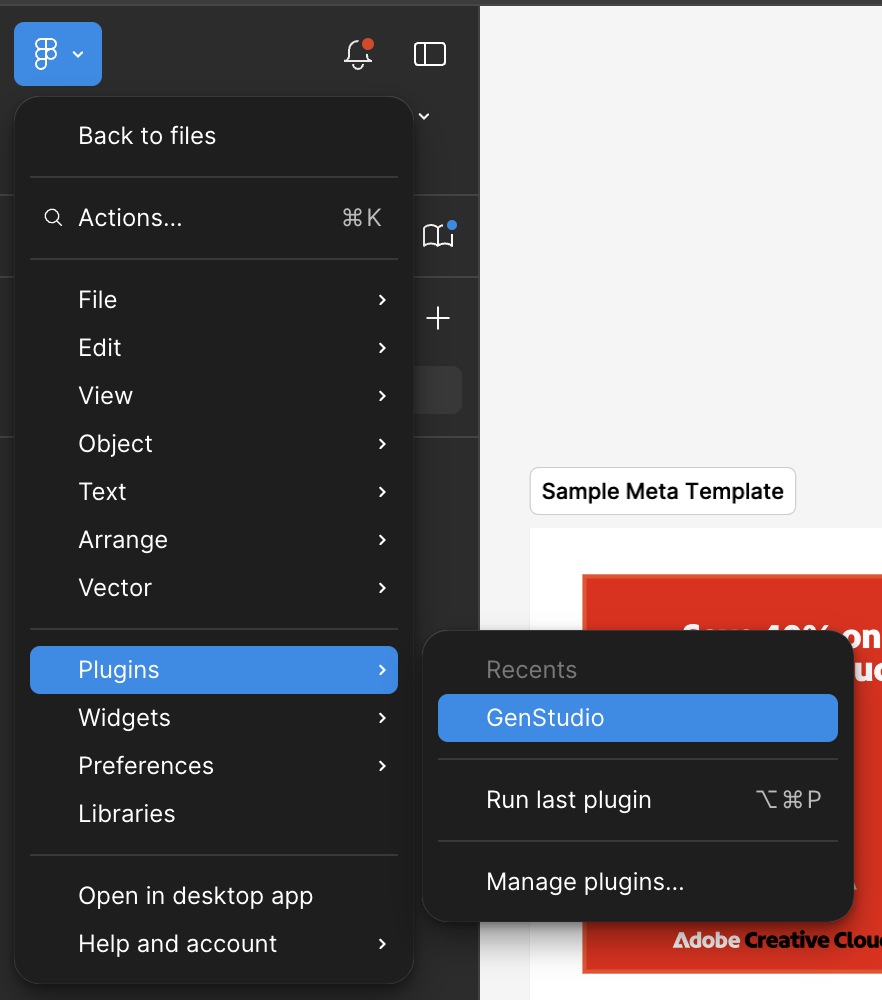
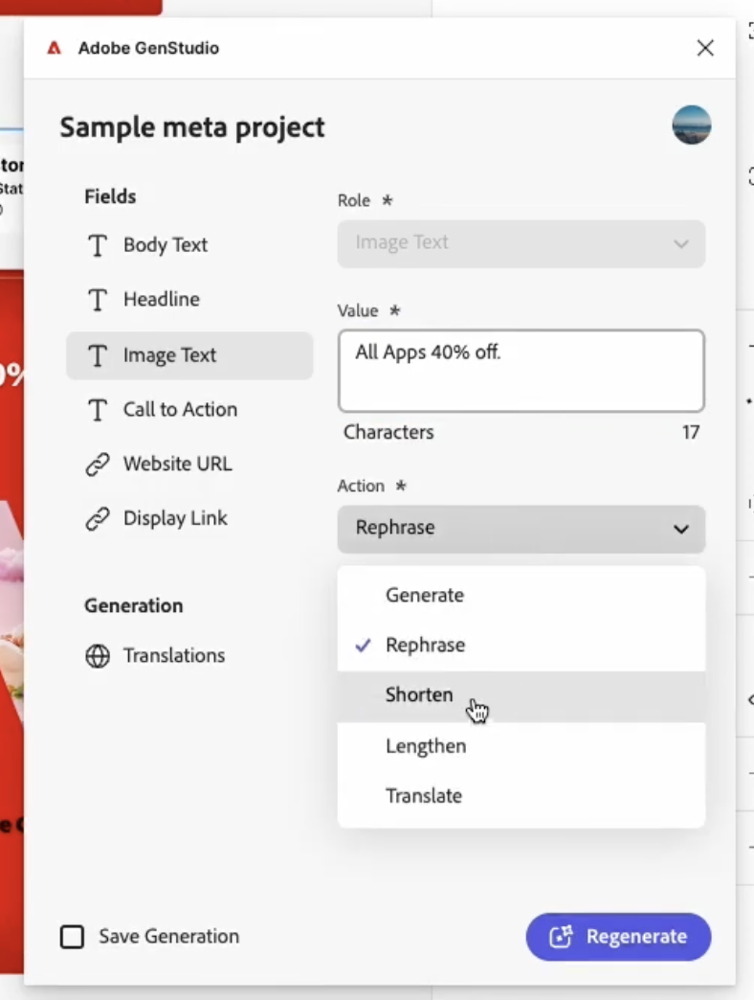

# Figma plugin for GenStudio for Performance Marketing

The GenStudio for Performance Marketing Figma plugin adds a new panel to the Figma application that allows users to perform GenStudio for Performance Marketing actions, like generating on-brand content.

This page describes how to configure and use the plugin.
Features of this plugin include:

* Map Figma text elements to GenStudio for Performance Marketing fields, such as `headline`, `body`, `on_image_text`, etc
* Generate new on-brand Meta ad or Display ad [!DNL Experiences] based on a brand, persona, product, and text prompt
* Create [!DNL Experiences] directly in the Figma document by replacing the text in mapped Figma elements with values generated by GenStudio for Performance Marketing
* Rephrase, shorten, lengthen, or translate existing content based on a prompt
* Translate generated [!DNL Experiences] into multiple languages
* Export generated [!DNL Experiences] to a local source as flattened images
* Export generated [!DNL Experiences] to GenStudio for Performance Marketing

## Install the plugin

1. Log in to [Figma](https://www.figma.com).
1. Ensure you have selected the _Adobe Enterprise_ team.
1. Click **[!UICONTROL All workspaces]** in the navigation pane.
1. Choose the **[!UICONTROL Plugins]** tab.
1. Click the card for **[!UICONTROL GenStudio]**.
1. Click **[!UICONTROL Open in]**, then either select one of your documents, or the _Playground file_.

At this point, either use the Figma desktop application or continue in a browser. The plugin can be found in whichever platform you choose.

1. On desktop, choose the **Plugins > From Adobe Enterprise > GenStudio** menu option.
1. On web, you can find the plugin in the navigation pane:
{width="300"}
1. On either platform, click the application icon {width="50"} in the floating doc at the bottom of the application, then choose the **Plugins & widgets** tab, and click **GenStudio**.
1. Once the plugin is open in Figma, sign in with your Adobe ID. Be sure to select a profile that has access to GenStudio for Performance Marketing.

Once the plugin is open the options are based on the selection in the Figma canvas.
Content in the plugin window will changed based on the current canvas selection.

# Generate new content

Use the GenStudio for Performance Marketing AI to generate or make variations to elements in Figma templates.

1. With your working template or sample template selected in the workspace, click the template section pane in the canvas.
1. In the plugin window, enter a project name for the variations, choose a platform for the content, and fill out the other required information. Then click the **[!UICONTROL Get Started]** button.
{width="300"}
1. Select the [!DNL Brand], [!DNL Persona], and [!DNL Product] to use for the content generation from the dropdown options.
1. Select the number of variations that will be produced and enter a text prompt.
1. Each field in the UI **[!UICONTROL Fields]** list will have the **[!UICONTROL Action]** option set to _Generate_ for new content.
1. Click the **[!UICONTROL Generate]** button.

## Other actions on content fields

When you're editing existing content in a field, you'll find useful options appear in the plugin panel.

{width="300"}

* Change the UI **[!UICONTROL Value]** to alter text directly. Changing this content automatically applies to all selected variations.
* The AI can perform many **Action** options which are selected from the dropdown, including:

    | Action                        | Description                                 |
    |-------------------------------|---------------------------------------------|
    | **[!UICONTROL Generate]**     | Generate a new variation of the text.       |
    | **[!UICONTROL Rephrase]**     | Generate a new variation of the text.       |
    | **[!UICONTROL Shorten]**      | Generate a shorter variation of the text.   |
    | **[!UICONTROL Lengthen]**     | Generate a longer variation of the text.    |
    | **[!UICONTROL Translate]**    | Translate the text into a different language.|

* A text prompt can always be entered to guide the AI.

## Export [!DNL Experiences]

To export

1. Select the parent section in the Figma canvas of the content that will be exported. Or click the UI **[!UICONTROL Save all Generations]** button to select all generated content for export.
1. Click the UI **[!UICONTROL Export]** option in the plugin panel.
1. Select a destination.
1. Click the UI **[!UICONTROL Export]** button to export the content.