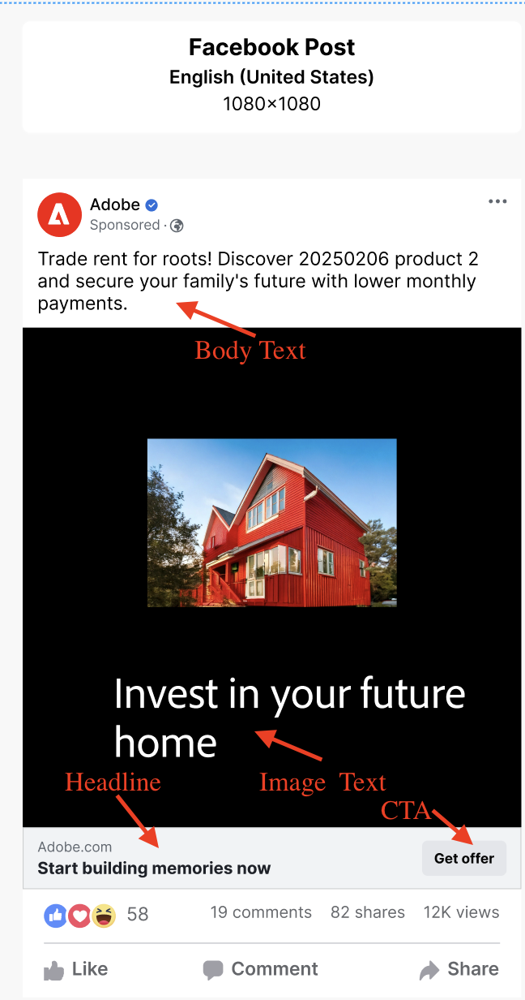
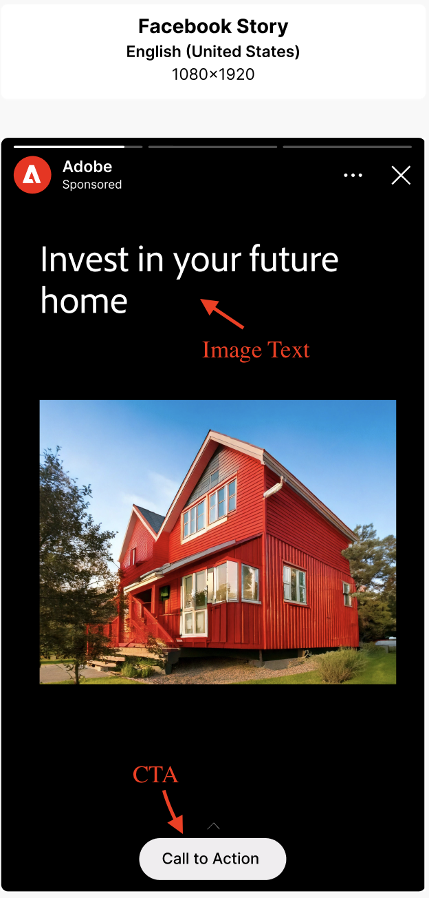
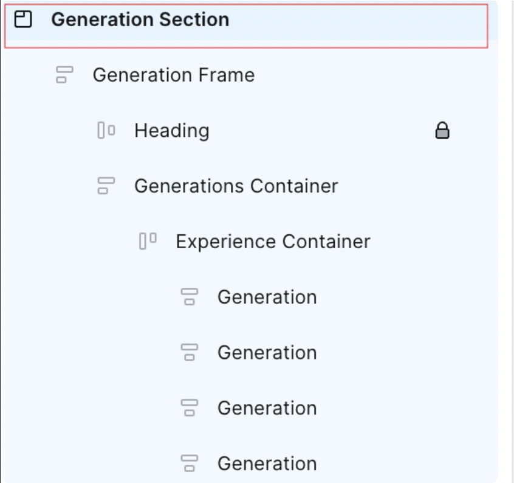
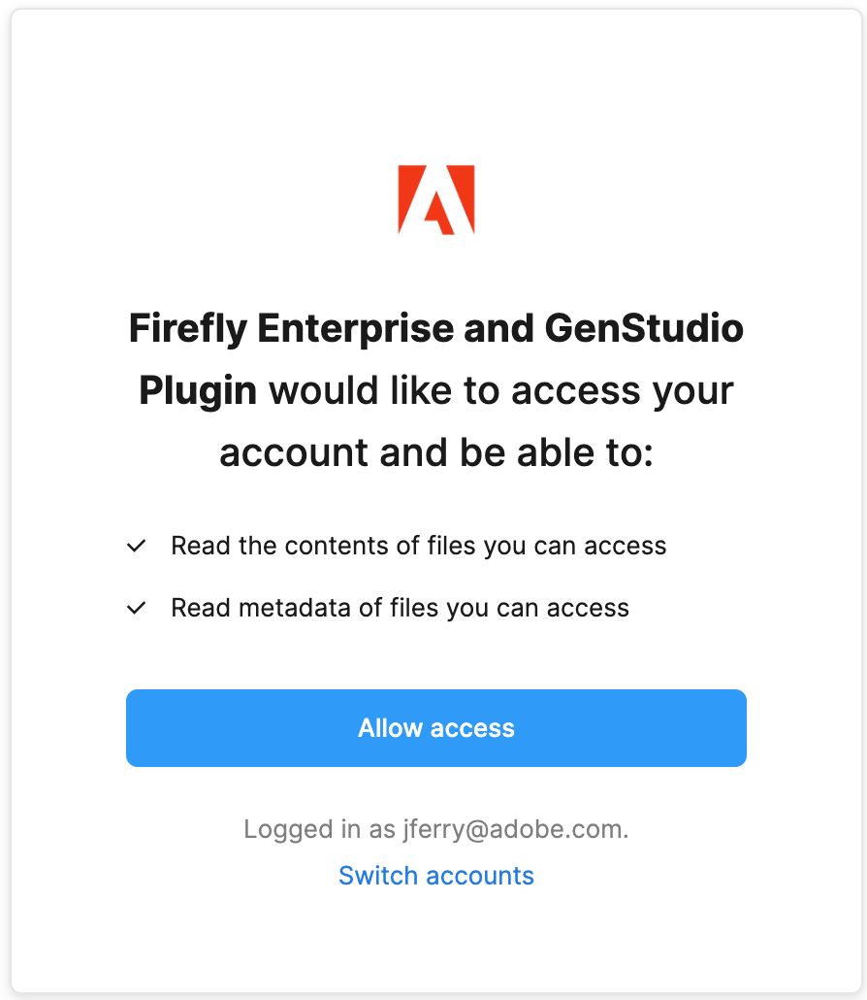

# Figma plugin for GenStudio for Performance Marketing

The GenStudio for Performance Marketing Figma plugin adds a new panel to the Figma application that lets you generate on-brand content.
[Find and install the plugin from the Figma community marketplace](https://www.figma.com/community/plugin/1604251370122180013/firefly-enterprise-and-genstudio).

This page describes how to configure and use the plugin.

Features of this plugin include:

* Map Figma text elements to GenStudio for Performance Marketing fields, such as `headline`, `body`, `on_image_text`, and more.
* Generate new on-brand Meta, LinkedIn, or Display ad [!DNL Experiences] based on a brand, persona, product, and text prompt.
* Create [!DNL Experiences] directly in the Figma document by replacing the text in mapped Figma elements with values generated by GenStudio for Performance Marketing.
* Rephrase, shorten, lengthen, or translate existing content based on a prompt.
* Translate generated [!DNL Experiences] into multiple languages.
* Export generated [!DNL Experiences] to a local source as flattened images.
* Export generated [!DNL Experiences] to GenStudio for Performance Marketing.
* Use plugin options that adapt to the selected elements in the Figma canvas.

>[!VIDEO](https://video.tv.adobe.com/v/3478809?learn=on)

## Create a template

The plugin requires the first two levels of your Figma document to follow this convention:

* **Section** - This represents the parent project, which can contain multiple templates.
* **Frame** - This represents a template within a project. The template can be filled with text, images, components, and other elements.

### Meta templates

These template sizes are supported:

For Instagram or Facebook posts:

* Width: 1080 px (fixed)
* Height: 1080 px or 1350 px

For Instagram or Facebook stories:

* Width: 1080 px (fixed)
* Height: 1920 px

The plugin decides the chrome of the generated experience based on the height of the template.

### Display templates

There is no fixed size requirement. Display templates support any size.

### LinkedIn templates

* Width: 1200 px (fixed)
* Height: 1200 px, 628 px, 2292 px, 1800 px, or 1500 px

### Field role mapping

The plugin needs to understand the different elements of your template, like headline, body text, or image.

**Meta field roles include**:

* Image
* Image text
* CTA
* Body text
* Headline
* Website URL
* Display link
* Manual fields

See how some of these field roles are mapped below.

| {width="60%" align="center" zoomable="yes"} | {width="70%" align="center" zoomable="yes"}  |
|:---:|:---:|
| {width="60%" align="center" zoomable="yes"}  | {width="70%" align="center" zoomable="yes"}  |

**LinkedIn field roles include**:

* Image
* Introductory text
* Image text
* Headline
* CTA
* Website URL
* Manual fields

See how some of these field roles are mapped below.

{width="30%" align="center" zoomable="yes"}

The plugin remembers these mappings to use for generated content. A field role can be mapped to multiple template elements. Manual fields are for elements that you would like to preserve text edibility but won't be marked for generation.

>[!IMPORTANT]
>
> **You must map an image** by assigning the `image` field role to at least one image element in your template.

To assign element roles:

1. Select an element in your template (text, image, and so on).
1. Use the dropdown menu to assign a role.

{width="60%" zoomable="yes"}

{{$include /help/_includes/field-mapping-exceptions.md}}

## Generate new content

Use GenStudio for Performance Marketing AI to generate or make variations to elements in Figma templates.

1. If you use the GenStudio Plugin Playground or already prepared templates, select the section node that contains your ad templates. You can do this from the **Layers** panel or by clicking directly on the section in the canvas.
{width="50%" zoomable="yes"}
1. In the plugin window, enter a project name for the variations, choose a platform for the content, and fill out the other required information. Then click the **[!UICONTROL Finish Setup]** button.
{width="30%" zoomable="yes"}
1. Select the [!DNL Brand], [!DNL Persona], and [!DNL Product] to use for the content generation.
1. Select the number of variations to be produced (up to eight).
1. Use the button under **[!UICONTROL Select Content]** to browse and choose images from your assets. The 40 most recently added assets appear first, and you can search for other assets. Selected images are automatically resized to fit your templates.
1. Enter a text prompt. Each field in the **[!UICONTROL Fields]** list has the **[!UICONTROL Action]** option set to **[!UICONTROL Generate]** for new content.
1. Map all the field roles. See [Field role mapping](#field-role-mapping).
1. Click the **[!UICONTROL Generate]** button.

## Translate or generate ad copy variations from existing content

Use GenStudio for Performance Marketing AI to generate ad copy variations or translate Figma templates.

1. Select the section node that contains your ad templates. You can do this from the **Layers** panel or by clicking directly on the section in the canvas.
{width="50%" zoomable="yes"}
1. In the plugin window, enter a project name for the variations and choose a platform for the content.
1. In **[!UICONTROL What is the goal?]**, select **[!UICONTROL Generate Variations]** or **[!UICONTROL Translate]**, then click the **[!UICONTROL Finish Setup]** button.
{width="30%" zoomable="yes"}
1. Select the [!DNL Brand], [!DNL Persona], and [!DNL Product] to use for the content generation.
1. Select the number of variations to be produced.
1. Use the button under **[!UICONTROL Select Content]** to browse and choose images from your assets. The 40 most recently added assets appear first, and you can search for other assets. Selected images are automatically resized to fit your templates.
1. Enter a text prompt. Each field in the **[!UICONTROL Fields]** list has the **[!UICONTROL Action]** option set to **[!UICONTROL Generate]** for new content.
1. Map all the field roles. See [Field role mapping](#field-role-mapping).
1. Select each field type to generate variations or translate in the panel on the left side of the plugin, and paste the initial content into each **[!UICONTROL Initial Content]** box.
{width="60%" zoomable="yes"}
1. Click the **[!UICONTROL Generate]** button.

## Translate content after generation

1. Select a generation that you want to translate.
{width="20%" zoomable="yes"}
1. Choose **[!UICONTROL Translation]**, then click **[!UICONTROL Translate]**.
1. Select your target language or languages.
1. Click **[!UICONTROL Select]**.

Translation results include:

* A new page appears with translated content.
* Each translation shows the target language or locale.
* Original content remains unchanged in the original page.

{width="60%" zoomable="yes"}

## Other actions on content fields after generation

When you're editing existing content in a field, useful options appear in the plugin panel.

{width="30%" zoomable="yes"}

Options include:

* Change the **[!UICONTROL Value]** to alter text directly. Changing this content automatically applies to all selected variations.
* The AI can perform many **[!UICONTROL Action]** options, including:

| Action | Description |
| --- | --- |
| **[!UICONTROL Generate]** | Generate a new variation of the text. |
| **[!UICONTROL Rephrase]** | Generate a new variation of the text. |
| **[!UICONTROL Shorten]** | Generate a shorter variation of the text. |
| **[!UICONTROL Lengthen]** | Generate a longer variation of the text. |

After selecting an **[!UICONTROL Action]** option, regenerate content with the **[!UICONTROL Regenerate]** button.

## Export experiences

Variations can be exported from Figma as GenStudio for Performance Marketing [!DNL Experiences].

1. Select the content to be exported in the Figma canvas by doing one of the following:
   * Select the generation section in the canvas, then click **[!UICONTROL Mark all for Export]** in the plugin panel.
   {width="20%" zoomable="yes"}
   * Select an individual generation in the canvas, then click **[!UICONTROL Mark for Export]** in the plugin panel.
   {width="20%" zoomable="yes"}
1. Select the Export item from the sidebar menu.
{width="60%" zoomable="yes"}
1. Select a destination.
1. Click **[!UICONTROL Export]** to export the content.

A ZIP file is created in the plugin panel, or a link to **[!UICONTROL Open in GenStudio]** appears. Use the ZIP link to choose where to save the file, or select **[!UICONTROL Open in GenStudio]**.

## Convert Figma frames to Photoshop

>[!NOTE]
>
> To perform this task, you need both the Figma plugin and [GenStudio Photoshop](photoshop-plugin.md).

You can use the Figma plugin to convert a Figma frame, multiple frames, or an entire document to Photoshop format and export it for use with [GenStudio Photoshop](photoshop-plugin.md). Currently, only major properties such as visibility, font size, and basic layer attributes are supported during conversion. Features such as strikethrough, superscript, subscript, opacity as percentages, gradients, and similar advanced properties are not yet supported.

<!-- GS-34076: Demo video placement is hardcoded in the tool UI; keep this video above "The plugin supports the following Figma layer types for conversion." -->
>[!VIDEO](https://video.tv.adobe.com/v/3492271?learn=on)

The plugin supports the following Figma layer types for conversion:

* **Frame**
* **Group**
* **Instance**
* **Text**
* **Vector**
* **Image**

When you convert to PSD, supported layers map to Photoshop as follows:

| Figma layer type | Converts to Photoshop | Notes |
| --- | --- | --- |
| **Frame** | Layer group | <ul><li>Figma frames are converted into Photoshop layer groups.</li><li>Nested frames become nested groups.</li><li>Frame dimensions become the PSD artboard or group bounds (depending on selection).</li></ul> |
| **Group** | Layer group | <ul><li>Figma groups convert directly into Photoshop layer groups.</li><li>Layer hierarchy and stacking order are preserved.</li></ul> |
| **Instance** | Layer group | <ul><li>Components and instances are flattened into standard Photoshop layer groups. Component metadata and variant logic are not preserved.</li><li>All child layers remain inside the group.</li></ul> |
| **Text** | Text layer | <ul><li>Figma text layers convert into editable Photoshop text layers.</li><li>Text hierarchy and positioning are preserved.</li></ul> |
| **Vector** | Shape layer | <ul><li>Figma vector layers convert into Photoshop shape layers.</li><li>Paths are preserved when possible.</li><li>Complex vectors may be rasterized if unsupported effects are applied.</li></ul> |
| **Image** | Raster layer | <ul><li>Figma image layers convert into Photoshop raster layers.</li><li>Image scaling and positioning are preserved.</li></ul> |

### How to convert frames

To convert frames:

1. Open the Firefly Enterprise and GenStudio plugin in Figma and click the **[!UICONTROL Export]** tab in the plugin UI.
1. On the canvas, select the frame or frames to export. You can choose a single frame or multiple frames.

   >[!NOTE]
   >
   > Frames cannot be within a section during conversion. Select frames that are not nested inside a section node.

1. To migrate the selected frame(s), do one of the following:

   * Click **[!UICONTROL Export]** to export the converted file to a chosen location, or
   * Click **[!UICONTROL Transfer to Photoshop]** to cache the converted file for immediate use in GenStudio Photoshop.
{width="40%"}
1. Next, share your Figma file link. The plugin needs a Figma file URL to complete the conversion. Add the URL for your document.

   1. In Figma, click **[!UICONTROL Share]** in the upper-right corner of the canvas.
   1. In **[!UICONTROL Share this file]**, click **[!UICONTROL Copy link]**.
   1. Paste the copied link into the **[!UICONTROL Figma File link]** field in the [!DNL GenStudio for Performance Marketing] plugin dialog. This needs to be done FOR EACH FILE:
  {width="35%"}
   1. Click **[!UICONTROL Submit]**.
1. A pop-up will appear asking for access to read the contents and metadata of your file. This only needs to be done once for all files. Click **[!UICONTROL Allow access]**. The plugin will read the selected frames in Figma and convert them to a JSON document, an intermediary format for the file data.
{width="35%"}
1. In Photoshop, open [!DNL GenStudio Photoshop] and click the **[!UICONTROL Import]** tab.
1. To select the converted file(s) do one of the following steps :

   * Click **[!UICONTROL From Plugin]** to choose a file converted with **[!UICONTROL Transfer to GenStudio Photoshop]** from the cached files list, or
   * Click **[!UICONTROL Upload JSON]** to browse to and select the JSON file to upload.
{width="40%"}
1. GenStudio Photoshop converts the information from the JSON document into an open Photoshop document.
1. Click **[!UICONTROL Done]**. The new file opens in Photoshop and is ready to use. Or click **[!UICONTROL Save As...]** to choose a location to save the file.
{width="40%"}

## Generation history

The plugin maintains a history of changes for each field. On the template page, choose **[!UICONTROL Generation history]** in the plugin sidebar.

{width="80%" zoomable="yes"}

## Troubleshooting

Consider these best practices and tips if text or images are not being replaced in generated variations.

### Mapped fields

If text or images are not being replaced, check that fields have been mapped to GenStudio field roles in the plugin UI. See [Field role mapping](#field-role-mapping).

### Confirm fonts are available

A text field's font must be available on your machine for replacement to occur during generation. Confirm that all fonts used in the file are available on your machine, especially if the file was created on someone else's machine.

### Consider field role support

Certain channels only support replacement in specific fields. Be aware of exceptions for [field role mapping](#field-role-mapping).
