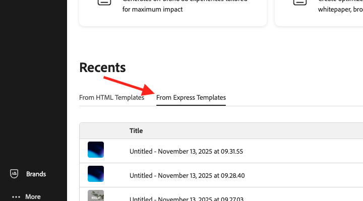

# Using [!DNL Adobe Express] templates

[!DNL GenStudio for Performance Marketing] can use templates that have been created and designed in [!DNL Adobe Express]. Bring branded assets from [!DNL Adobe Express] and use these powerful tools to integrate them in compelling marketing campaigns and [!DNL Experiences].

This guide explains the requirements and the features with templates from [!DNL Adobe Express].

## About templates in [!DNL Adobe Express]

In [!DNL Adobe Express], [new documents can be created using existing starter templates](https://helpx.adobe.com/express/web/documents-and-presentations/text-flow-template.html?x-product=Helpx%2F1.0.0&x-product-location=Search%3AForums%3Alink%2F3.7.5) that are provided in the application, or with [custom templates that can include helpful brand restrictions](https://helpx.adobe.com/express/web/brands-libraries-projects/create-manage-brands/edit-shared-template.html) like:

- [Locked elements](https://helpx.adobe.com/express/web/invite-collaborate/object-locking.html) that can't be altered
- Lock restrictions that control how users can unlock elements when needed

Lock settings that have been set on the template in [!DNL Adobe Express] will also be applied in [!DNL GenStudio for Performance Marketing]. Use [the [!DNL Adobe Express] instructions to create a custom template with brand restrictions](https://helpx.adobe.com/express/web/brands-libraries-projects/create-manage-brands/template-control.html).

To use custom fonts in an Express Template, admins must first accept the Custom Fonts qualifying offer in the admin console, which is included as part of the Express license entitlement.

## Find Express templates

Users will see new tabs in Create to select Express templates. Express templates can be accessed in GenStudio for Performance Marketing when those templates are:

- Created by the user
- Shared to the user
- Shared to the user's organization, using the same IMS org in both apps

Find any available Express templates in the Create workflow, after selecting a template type. Express templates are only available for the types:

- [!DNL Meta]
- [!DNL Display]
- [!DNL LinkedIn]
- [!DNL TikTok]

In the top bar under **[!UICONTROL Select template]**, find **Express templates**.

{width=400}

...after selecting a template type, in the top bar under **[!UICONTROL Express Templates]**.

{width=400}

When you select an [!DNL Express] template and click [!UICONTROL Use], the pre-draft parameters and prompt will appear in a popup panel on the left. Click the [!UICONTROL Generate] button to create new content with the selected template.

{width=400}

>[!IMPORTANT]
>
>During content generation, Express template layers will be automatically tagged with field roles for GenStudio or Performance Marketing.

## Features for variants and [!DNL Experiences]

[!DNL Express] templates offer many of the same features you'll be familiar with when [managing other variants](https://experienceleague.adobe.com/en/docs/genstudio-for-performance-marketing/user-guide/create/manage-variants#manually-edit-text). However, there are a few powerful additions to streamline any workflow for content from [!DNL Express]. This section describes features exclusive to the [!DNL Adobe Express] implementation.

### Auto-generate multiple sizes

When [multiple pages have been created for an asset in [!DNL Express]](https://helpx.adobe.com/express/web/arrange-layers-and-pages/add-pages.html), those pages are carried over to any template created from that asset. Express pages will each generate as different sizes of the creative content in [!DNL GenStudio for Performance Marketing]. 

When multiple sized content exists for an asset in [!DNL Express], variants can be generated for all those sizes in a single generation.

### Synchronized editing in Meta and LinkedIn

Templates for Meta and LinkedIn can have elements (like border panels or header bars) that are required in order to conform with the content's destination app. Editing content in a variant, like text, for these required elements is synchronized across all the variants generated in an Experience.

### Reposition and resize elements

Elements on a template can be resized or moved to fit by simply clicking and dragging those elements on the Canvas pane.

Resize by clicking and dragging an element from a corner point.

### Canvas pane header features

Use the buttons in the Canvas pane header to:

1. Retitle the draft
1. Change the level of zoom for viewing
1. Undo and redo changes

### Assign Experience group feedback

Assign feedback to each group of generated variants. These feedback labels help the AI understand which variants should be considered in subsequent generations.

 Click "..." to open the dropdown for:

- Good output 
- Poor output
- Delete - Deletes the group of variants.

### Delete a variant

A single variant size that's been generated in a group of Experiences can be deleted using the trash icon.

{width=300}

### Spacebar-to-pan

Hold **[!UICONTROL Space]** to enable a click-and-drag feature to "pull" the Canvas view pane. 

You can also move the view pane with a two-finger scroll.

## Review and approve

After editing and adjusting your variants, approve and publish your content with [the Reviews and Approval workflow](https://experienceleague.adobe.com/en/docs/genstudio-for-performance-marketing/user-guide/approve/overview).
