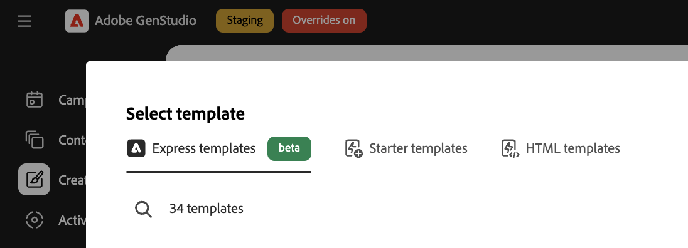
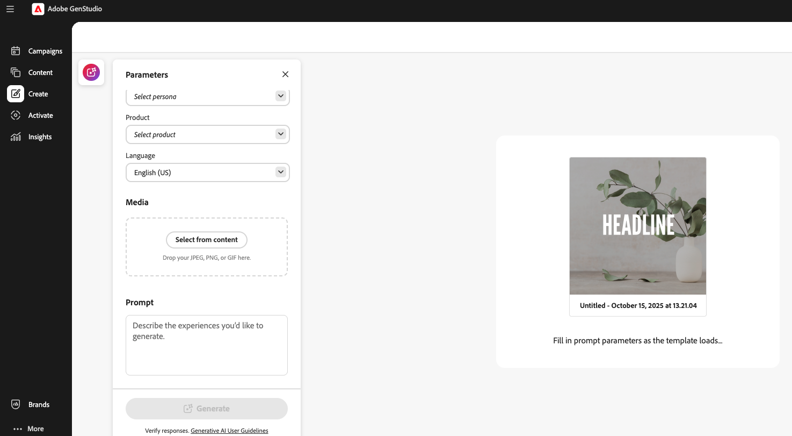
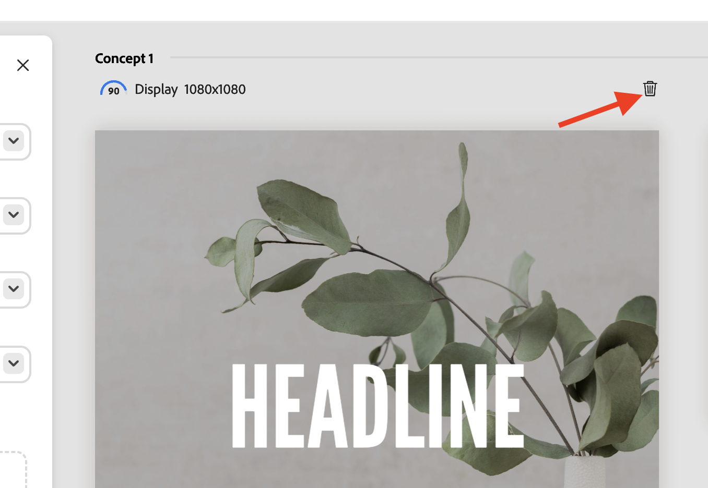
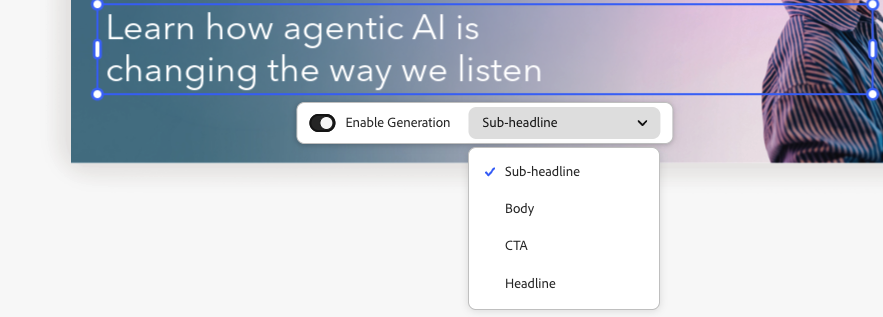
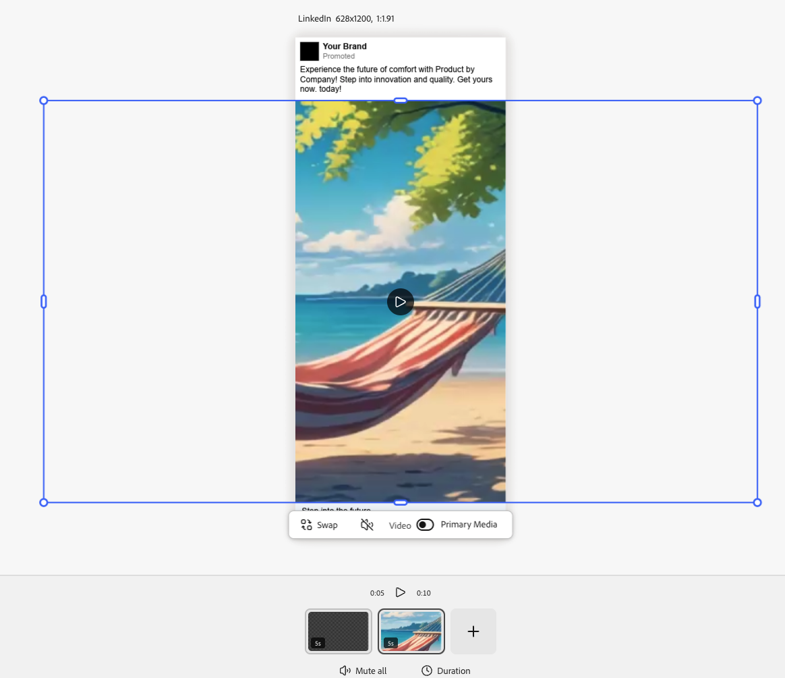

# Using [!DNL Adobe Express] templates

[!DNL GenStudio for Performance Marketing] can use templates that have been created and designed in [!DNL Adobe Express]. Bring branded assets from [!DNL Adobe Express] and use these powerful tools to integrate them in compelling marketing campaigns and [!DNL Experiences].

This guide explains the requirements and the features with templates from [!DNL Adobe Express]. For more tips and best practices, see [Best practices for using templates](/help/user-guide/templates/best-practices-for-templates.md#express-to-genstudio-template-best-practices).

## About templates in [!DNL Adobe Express]

In [!DNL Adobe Express], [new documents can be created using existing starter templates](https://helpx.adobe.com/express/web/documents-and-presentations/text-flow-template.html?x-product=Helpx%2F1.0.0&x-product-location=Search%3AForums%3Alink%2F3.7.5) that are provided in the application, or with [custom templates that can include helpful brand restrictions](https://helpx.adobe.com/express/web/brands-libraries-projects/create-manage-brands/edit-shared-template.html) like:

- [Locked elements](https://helpx.adobe.com/express/web/invite-collaborate/object-locking.html) that can't be altered
- Lock restrictions that control how users can unlock elements when needed

Lock settings that have been set on the template in [!DNL Adobe Express] will also be applied in [!DNL GenStudio for Performance Marketing]. Use [the [!DNL Adobe Express] instructions to create a custom template with brand restrictions](https://helpx.adobe.com/express/web/brands-libraries-projects/create-manage-brands/template-control.html).

To use custom fonts in an Express Template, admins must first accept the Custom Fonts qualifying offer in the admin console, which is included as part of the Express license entitlement.

## Find Express templates

Users will see new tabs in Create to select Express templates. Express templates can be accessed in GenStudio for Performance Marketing when those templates are:

- Created by the user
- Shared to the user
- Shared to the user's organization, using the same IMS org in both apps

Find any available Express templates in the Create workflow, after selecting a template type. Express templates are only available for the types:

- [!DNL Meta]
- [!DNL Display]
- [!DNL LinkedIn]
- [!DNL TikTok]

In the top bar under **[!UICONTROL Select template]**, find **Express templates**.

{width=70%}

When you select an [!DNL Express] template and click **[!UICONTROL Use]**, the pre-draft parameters and prompt will appear in a popup panel on the left. Click the **[!UICONTROL Generate]** button to create new content with the selected template.

{width=90%}

>[!IMPORTANT]
>
>During content generation, Express template layers will be automatically tagged with field roles for [!DNL GenStudio for Performance Marketing]. Elements on a template can also be [manually tagged](#manual-tagging-of-templates).

## About variants and [!DNL Experiences] with [!DNL Adobe Express] templates

[!DNL Express] templates offer many of the same features you'll be familiar with when [managing other variants](https://experienceleague.adobe.com/en/docs/genstudio-for-performance-marketing/user-guide/create/manage-variants#manually-edit-text). However, there are a few powerful additions to streamline any workflow for content from [!DNL Express]. This section describes features exclusive to the [!DNL Adobe Express] implementation.

### Auto-generate multiple sizes

When [multiple pages have been created for an asset in [!DNL Express]](https://helpx.adobe.com/express/web/arrange-layers-and-pages/add-pages.html), those pages are carried over to any template created from that asset. Express pages will each generate as different sizes of the creative content in [!DNL GenStudio for Performance Marketing].

When multiple sized content exists for an asset in [!DNL Express], variants can be generated for all those sizes in a single generation.

### Reposition and resize elements

Elements on a template can be resized or moved to fit by simply clicking and dragging those elements on the Canvas pane.

Resize by clicking and dragging an element from a corner point.

### Canvas pane header features

Use the buttons in the Canvas pane header to:

1. Retitle the draft
1. Change the level of zoom for viewing
1. Undo and redo changes

### Assign Experience group feedback

Assign feedback to each group of generated variants. These feedback labels help the AI understand which variants should be considered in subsequent generations.

 Click "..." to open the dropdown for:

- Good output
- Poor output
- Delete - Deletes the group of variants.

### Delete a variant

A single variant size that's been generated in a group of Experiences can be deleted using the trash icon.

{width=300}

### Spacebar-to-pan

Hold **[!UICONTROL Space]** to enable a click-and-drag feature to "pull" the Canvas view pane.

You can also move the view pane with a two-finger scroll.

### Manually edit text

You can edit the text fields in generated variants. Refine the text for your audience by experimenting with different phrases and verbiage and by applying formatting. For example, you can bold and right align the text for a variant to accommodate the layout of an image.

{width=60%}

Available text formatting includes:

- Bold, Italic, and Underline
- Text color (black, white, or brand colors)
- Left, center, and right align
- Bulleted and ordered lists
- Text size
- Superscript or subscript

**To edit text manually in generated variants**:

1. After generating a set of variants, double-click editable text in a variant.
1. Enter new text.
1. To format the text, click on or type in the text box element. Formatting options will appear in a popup bar. Holding Shift hides the bar to view the text.
1. Click away from the text field to save any changes.

### View layers

You can quickly select an individual layer of a variant and make changes, such as re-generating sections or cropping images. When you select an individual layer, the editable fields or images within the layer are highlighted.

**To view the layers of a variant**:

1. After generating a set of variants, click an editable field or image within a variant. Layers will appear in a line of tiles in the upper right.
{width=50%}
1. Click a layer tile to select it. The selected layer is highlighted for the variant.
1. Proceed with making any necessary edits to the selected layer.

### Rewrite sections

[!DNL GenStudio for Performance Marketing] has the built-in functionality to regenerate sections of generated variants. You can rephrase, shorten, or lengthen text, or add fresh prompts to generate new content.

For example, you can re-generate the headline section of one Meta ad variant to see how it looks with a specific background asset. You can **[!UICONTROL Rephrase]**, **[!UICONTROL Shorten]**, or **[!UICONTROL Lengthen]** a section's text content, or **[!UICONTROL Regenerate]** text using a guiding prompt.

{width=50%}

**To rewrite individual variant sections**:

1. After generating a set of variants, single-click any editable text in a variant. The wand icon will appear.
1. Click the wand icon to open the Rewrite pane.
1. To alter the existing text, select **[!UICONTROL Rephrase]**, **[!UICONTROL Shorten]**, or **[!UICONTROL Lengthen]**.
1. To generate new phrasing options, select **[!UICONTROL Regenerate]** and enter a new prompt.
   1. Click **[!UICONTROL Generate]**.
1. The results appear as options in the pane. Select the desired option and click **[!UICONTROL Replace]**. The variant is updated with the revised text.

{width=50%}

### Crop assets

You can manually crop and reposition image assets in individual generated variants with the Crop tool.

**To crop and reposition images in variants**:

1. After generating a set of variants, double-click an asset to activate the bounding box.
1. Adjust the image bounding box by dragging from any edge or corner, or drag the whole image into the desired position.

### Swap assets

You can add or swap images, approved logos, or video assets in generated variants right from the Canvas UI.

**To add or swap assets in a variant**:

1. After generating a set of variants, click an asset (or the image asset area if an image does not currently exist). A swap icon appears.
1. Click the swap icon to open the Select assets page.
1. Use the filters and search function in the GenStudio assets Content view to further narrow your search results.
1. You can also use images available in connected [!DNL Adobe Experience Manager] (AEM) Assets Content Hub repositories by selecting that repository from the **[!UICONTROL Location]** menu.
1. Click to select an image and click **[!UICONTROL Use]**. The image is added or swapped into the applicable variant.

### Manual tagging of templates

Elements in templates are automatically tagged during [template generation](#find-express-templates) in the Create workflow. But these elements can also be manually tagged.

**To manually tag a template element**:

1. Select the element on the template.
1. Use the dropdown to select the tag for that element.
{width=80%}

Tagging options vary depending on the type of element.

### Template lock restrictions

Templates can include [locked elements](https://helpx.adobe.com/express/web/invite-collaborate/object-locking.html) that carry over from [!DNL Express] and control how some features may be altered. These settings are respected by the template, and can also be altered on the template:

1. Select a locked element on the template.
1. Click the lock icon in the top left for the selected element.
1. Select the correct option to unlock the element.
{width=60%}

### Video Assembly

Templates that include videos can take advantage of the Video Assembly features.

**To use Video Assembly**:

1. Select an experience and click the **[!UICONTROL Edit]** button to enter focus mode and use Video Assembly features. Only the single variant will be displayed and the scene line will be displayed along the bottom.
{width=70%}
1. Adjust your video experience. Video Assembly options include:
   - Play videos
   - Mute and unmute sound
   - Add new video content with the "+" button
   - Video duration settings
   - Change the order of video content with drag and drop
1. When you've finished editing your video, use the **[!UICONTROL Exit]** button at the top to save changes and return to the infinite canvas.

### Modify images with Generative Expand

Image layers can have their boundaries expanded with AI to fit any desired dimensions in an experience.

**To expand an image with Generative Expand**:

1. Select an unlocked image layer and click the **[!UICONTROL Expand]** button at the bottom of the image frame.
{width=70%}
1. Pull the frame to the desired dimensions where the image will be expanded. The Expand options window will appear. In the Expand options, you can facilitate the expansion by:
   - Entering a prompt
   - Choosing to fit to frame
   - Reset the dimensions
{width=50%}
1. Click **[!UICONTROL Expand]** to create the generation. Variants to choose from will appear at the bottom of the frame.
1. Select the best variant and click **[!UICONTROL Keep]**.
{width=50%}

{width=60%}

### Brand validation

Use the _Content check_ panel to maintain consistent brand identity, ADA accessibility standards, platform guidelines, and alignment of variants.

See [Brand validation](/help/user-guide/guidelines/brand-validation.md).

## Review and approve

After editing and adjusting your variants, approve and publish your content with [the Reviews and Approval workflow](https://experienceleague.adobe.com/en/docs/genstudio-for-performance-marketing/user-guide/approve/overview).

